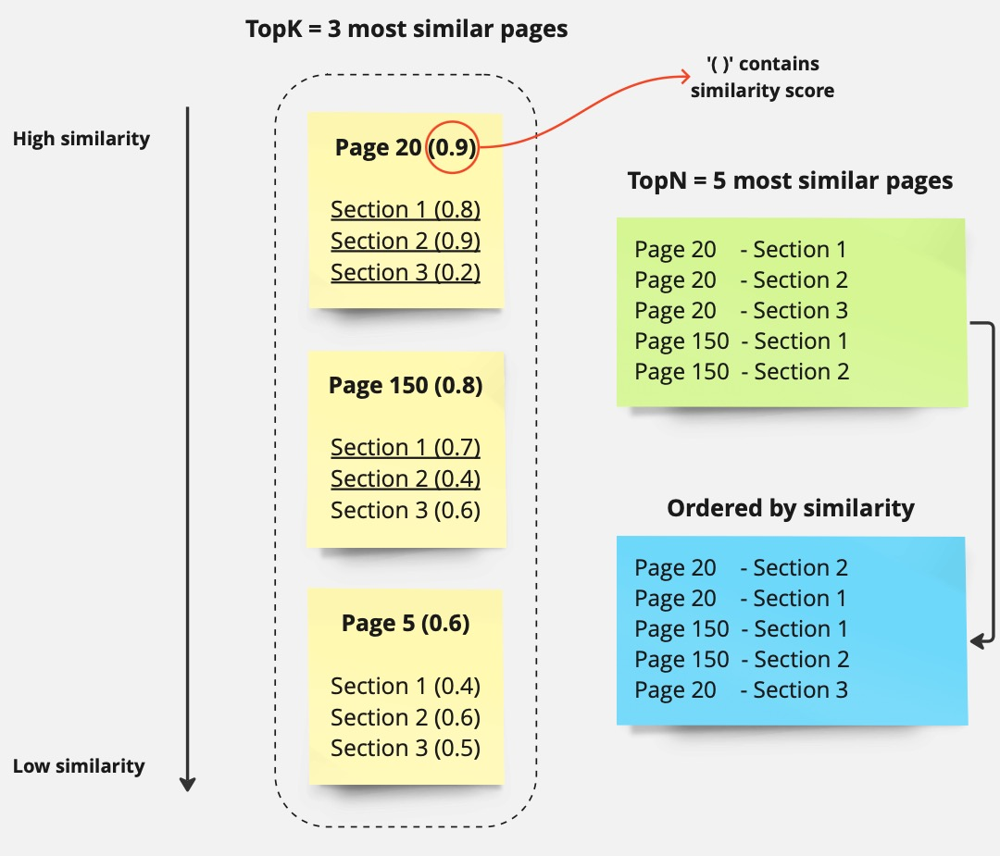
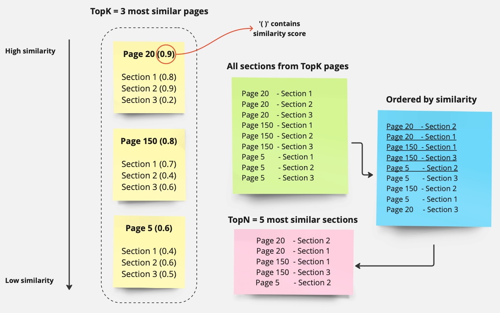
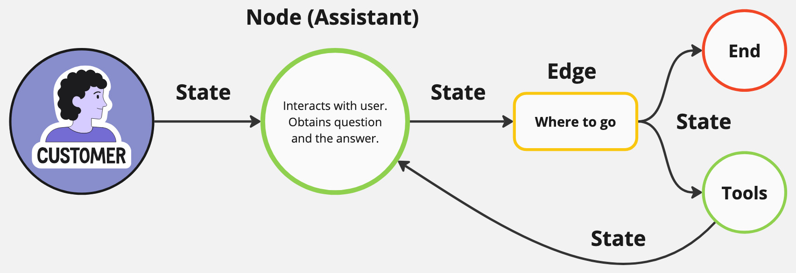
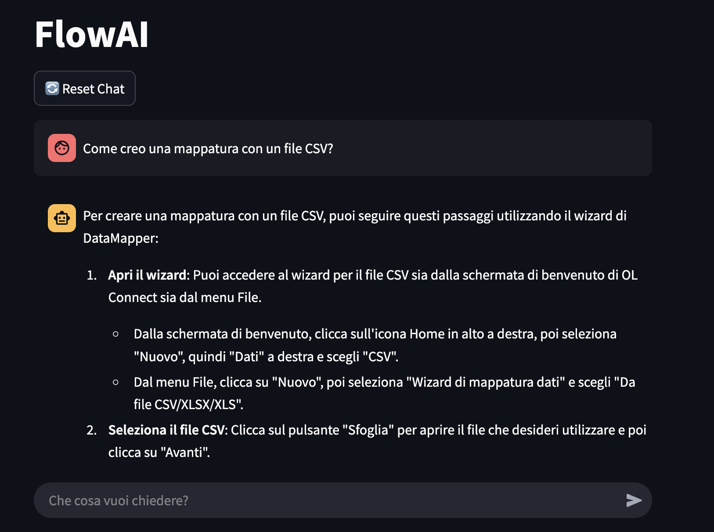

:::::::::: titlingpage*
::::::::: center
:::::::: DoubleSpace
**Università degli Studi di Modena e Reggio Emilia**

------------------------------------------------------------------------

Dipartimento di Ingegneria \"Enzo Ferrari\"

Corso di Laurea Magistrale in Ingegneria Informatica

**Progettazione e implementazione di un assistente IA generativo per il
supporto del servizio clienti utilizzando Large Language Models e
Retrieval-Augmented Generation**

::::::: minipage
:::: minipage
::: flushleft
**Candidato**:\
Davide Abba
:::
::::

:::: minipage
::: flushright
**Relatore**:\
Prof. Francesco Guerra\
**Correlatore**:\
Dott. Michele Luca Contalbo
:::
::::
:::::::

------------------------------------------------------------------------

Anno accademico 2023-2024
::::::::
:::::::::
::::::::::

# Abstract

L'Intelligenza Artificiale (IA) sta diventando una componente essenziale
delle imprese moderne, contribuendo all'automazione delle attività, al
miglioramento della produttività e alla risoluzione di problemi
complessi. L'IA generativa, in particolare i Large Language Models (LLM)
[@minaee2024largelanguagemodelssurvey], ha trasformato il modo in cui i
computer comprendono e generano il linguaggio umano, rendendo possibile
la creazione di assistenti virtuali intelligenti. Tuttavia, gli LLM
standard presentano limitazioni poiché si basano esclusivamente su
conoscenze preesistenti, che possono risultare obsolete o incomplete
quando si tratta di rispondere a domande specifiche relative all'ambito
aziendale.

Questa tesi presenta lo sviluppo di un assistente AI progettato per
migliorare l'efficienza aziendale combinando gli LLM con la
Retrieval-Augmented Generation (RAG)
[@gao2024retrievalaugmentedgenerationlargelanguage]. Il sistema
implementa due livelli di recupero delle informazioni: un recupero a
livello di pagina per identificare i documenti pertinenti e un recupero
a livello di sezione per estrarre le informazioni più rilevanti.
L'assistente è costruito utilizzando strumenti open-source, tra cui
llama-cpp [@llama-cpp] e Ollama [@ollama] per l'esecuzione locale del
modello AI, un database PgVector [@pgvector] per l'archiviazione e il
recupero delle informazioni, e una configurazione basata su Docker
[@dockerDesktop2025] per facilitare il deployment.

Per valutare le prestazioni del sistema, è stato creato un dataset di
100 domande accuratamente selezionate, consentendo una valutazione
dettagliata dell'efficacia del recupero e della generazione delle
risposte. I risultati dimostrano che la combinazione di LLM con RAG
migliora significativamente la precisione nel recupero delle
informazioni pertinenti rispetto all'utilizzo del solo LLM, con il
sistema a doppio livello di recupero che ottiene prestazioni superiori
nella risposta a domande specifiche sulla documentazione.

Le possibili direzioni future includono il raffinamento del processo di
recupero e l'espansione della base di conoscenza del sistema per
renderlo ancora più affidabile ed efficace.

# Ringraziamenti

Per cominciare, vorrei ringraziare la mia famiglia per il sostegno
fornito durante questa seconda laurea. Non è stato un percorso semplice
da portare a termine, la mia vita in questi anni ha subito un forte
cambiamento e non è stato facile trovare l'equilibrio giusto che mi
consentisse di affrontare le sfide portate dagli esami che ho spesso
paragonato a montagne. Un ringraziamento speciale lo dedico a Sofia, la
quale si è dimostrata importante proprio in quello stesso periodo,
dandomi l'appoggio di cui avevo bisogno nel momento giusto.

Ringrazio anche la Flow Factory, il mio relatore Francesco Guerra e il
correlatore Michele Luca Contalbo per avermi appoggiato nella
realizzazione di questo progetto ambizioso, riuscendomi a dare le giuste
linee guida in un mondo a me nuovo dal punto di vista pratico. È con
questa tesi che ho chiarito a me stesso cosa mi appassionerà da qui in
avanti dell'informatica e l'augurio che mi faccio è quello di poter
trasformare questo lavoro in qualcosa di più grande.

In ultimo devo ringraziare me stesso, per aver portato a termine due
percorsi di laurea così impegnativi e importanti per il mio futuro, per
non aver mollato, per averci messo impegno, passione e per essere
riuscito a portare a casa l'obiettivo principale di questa facoltà:
essere capace di ingegnarmi.

# Introduzione

L'Intelligenza Artificiale Generativa rappresenta un progresso
significativo nel campo dell'apprendimento automatico. Questa tecnologia
consente ai computer di creare testi, immagini, codice e altri output
attraverso l'apprendimento di pattern da grandi quantità di dati. A
differenza dei sistemi tradizionali che seguono regole specifiche, l'IA
Generativa, in particolare i Large Language Models (LLM), genera testo
in modo simile a quello umano prevedendo le parole successive sulla base
di un input. La modellazione del linguaggio ha trasformato diversi
settori, tra cui il servizio clienti, permettendo a chatbot e assistenti
virtuali di fornire risposte dettagliate e contestualizzate.

L'IA Generativa si basa sul deep learning, utilizzando modelli
transformer che elaborano e creano testo rilevante attraverso meccanismi
di self-attention. Questi modelli vengono addestrati su dataset testuali
ampi e diversificati e successivamente ottimizzati per compiti specifici
come la conversazione, la generazione di codice e la sintesi di
documenti.

Nel supporto clienti, l'IA Generativa riduce i tempi di risposta,
migliora l'accuratezza e garantisce una disponibilità costante.
Tuttavia, gli LLM presentano limitazioni poiché non possono accedere a
informazioni in tempo reale o specifiche dell'azienda, il che può
portare a risposte imprecise o obsolete. La Retrieval-Augmented
Generation (RAG) affronta questa problematica combinando gli LLM con il
recupero di informazioni. Anziché basarsi su dati di addestramento
statici, i sistemi basati su RAG recuperano informazioni rilevanti da
fonti esterne prima di generare risposte, migliorando così l'accuratezza
e la pertinenza delle risposte.

Tuttavia, un sistema RAG generico presenta una limitazione
significativa: spesso \"cita\" interi documenti senza fornire
informazioni più dettagliate sulla posizione esatta dei dati rilevanti.
Questo approccio risulta inefficiente quando l'utente necessita di
informazioni specifiche all'interno di documenti complessi.

Questo progetto utilizza l'IA Generativa per creare un assistente
intelligente per il supporto clienti in grado di gestire domande
relative al software. L'assistente implementa un sistema di recupero a
due livelli:

1.  **Recupero a livello di documento:** identifica i documenti più
    pertinenti alla query dell'utente, basandosi sulla similarità degli
    embeddings delle sezioni o sugli embedding medi pesati dei
    documenti. Ad esempio, per una domanda sulla configurazione di un
    modulo specifico, il sistema identifica prima la pagina (o
    documento) del manuale che contiene le informazioni su quel modulo.

2.  **Recupero a livello di sezione:** all'interno dei documenti
    selezionati, identifica le sezioni specifiche che contengono le
    informazioni più rilevanti per rispondere alla domanda, basandosi
    sulla similarità degli embeddings delle sezioni. Continuando
    l'esempio precedente, il sistema può individuare precisamente la
    sezione \"Configurazione avanzata\" all'interno del documento
    selezionato.

A differenza di chatbot generici come ChatGPT di OpenaAI o Google
Gemini, che si basano su conoscenze pubbliche, questo assistente IA è
progettato per garantire accuratezza in un dominio specifico.
Utilizzando il sistema RAG a due livelli, riduce al minimo gli errori e
offre alle aziende il controllo sulle informazioni condivise con gli
utenti. Questa soluzione è flessibile e può essere applicata ad altre
aree aziendali che necessitano di risposte automatizzate e accurate da
documenti strutturati.

### Contributi principali

I contributi principali di questa tesi includono:

1.  Lo sviluppo di un sistema RAG avanzato che implementa un recupero
    delle informazioni a due livelli (documento e sezione), superando le
    limitazioni dei sistemi RAG tradizionali.

2.  La creazione di un'architettura open-source, basata su strumenti
    come llama-cpp, Ollama e PgVector, che può essere facilmente
    implementata e adattata a diverse esigenze documentali.

3.  Un'analisi approfondita dell'efficacia del recupero a livello di
    sezione rispetto ai metodi di recupero tradizionali, dimostrando un
    miglioramento significativo nella precisione delle risposte quando
    si tratta di informazioni specifiche all'interno di documenti
    complessi.

4.  Una metodologia di valutazione per misurare l'accuratezza e la
    pertinenza delle risposte generate, basato su un dataset di 100
    domande rappresentative di scenari reali di supporto clienti.

Questa tesi analizza le tecnologie alla base dell'IA Generativa e del
RAG, il loro impiego in questo progetto e le sfide affrontate durante lo
sviluppo. Valuta inoltre come questo assistente IA migliori il supporto
clienti, dimostrando come la combinazione di IA Generativa con tecniche
di recupero avanzate possa rendere più efficienti le operazioni
aziendali e migliorare l'esperienza utente.

# Background

In questo capitolo esamino i concetti chiave e le tecnologie che
costituiscono la base dell'assistente AI sviluppato per questo progetto.
Ogni sezione fornisce una panoramica e una spiegazione degli strumenti e
delle metodologie utilizzati per progettare e implementare il sistema.

Introduco innanzitutto l'Intelligenza Artificiale Generativa e i Large
Language Models (LLM), le tecnologie fondamentali che consentono
all'assistente di comprendere e generare testo simile a quello umano.
Spiego brevemente inoltre l'architettura Transformer, che funge da
struttura portante per la maggior parte degli LLM moderni. La
discussione si estende alla tokenizzazione, il metodo di scomposizione
del testo per l'elaborazione da parte di questi modelli.

Esploro il formato GGUF, utilizzato per memorizzare e gestire modelli
per un'inferenza efficiente, insieme alla tecnica di Retrieval-Augmented
Generation (RAG), che fornisce contesto rilevante all'LLM recuperando
informazioni da fonti esterne.

L'uso di framework come LangChain [@langchain2025], che semplifica
l'orchestrazione degli LLM e dei processi di recupero, e Docker
[@dockerDesktop2025], che garantisce un ambiente di sviluppo e
deployment coerente, viene affrontato.

In ultimo, viene discussa la piattaforma HuggingFace [@huggingface2025],
una delle principali risorse per NLP e modelli pre-addestrati, per il
suo ruolo nel progetto.

## IA Generativa

L'**intelligenza artificiale generativa** è una branca dell'intelligenza
artificiale (IA) che si occupa della creazione di nuovi contenuti, come
testi, immagini e codice, a partire da dati esistenti. I modelli
generativi non si limitano a classificare, prevedere o analizzare dati,
ma sono anche in grado di produrre output che rispettano le
caratteristiche dei dati su cui sono addestrati.

Nel contesto di questo progetto, l'IA Generativa è alla base
dell'assistente sviluppato per migliorare il servizio di supporto
clienti. Grazie all'uso di **modelli di linguaggio di grandi dimensioni
(LLMs)**, l'assistente è in grado di comprendere le richieste degli
utenti e generare risposte pertinenti e contestualizzate.

I vantaggi che questo tipo di tecnologia può portare all'interno di un
ambito aziendale sono numerosi, tra cui una maggiore efficienza
operativa, una riduzione dei costi di supporto e un miglioramento della
soddisfazione dei clienti grazie a risposte rapide e coerenti.

### Large Language Models (LLMs)

I **Modelli di Linguaggio di Grandi Dimensioni** sono una tipologia di
modelli di intelligenza artificiale specializzati nell'elaborazione del
linguaggio naturale. Sono progettati per comprendere, manipolare e
generare il testo sfruttando grandi quantità di dati e reti neurali
profonde, le quali consentono di apprendere le strutture linguistiche,
il significato contestuale e concetti complessi.

Gli LLM si basano principalmente sull'**architettura Transformer**
[@DBLP:journals/corr/VaswaniSPUJGKP17], la quale ha rivoluzionato il
campo del **Natural Language Processing (NLP)** grazie al meccanismo di
***self-attention***, superando le problematiche che affliggono altre
tipologie di reti neurali come le reti RNN (*Recurrent Neural Network*)
e LSTM (*Long Short-Term Memory*), ovvero i precedenti modelli di
riferimento per l'elaborazione del linguaggio.

Queste infatti presentano alcune limitazioni, come **(i) difficoltà di
parallelizzazione**: l'elaborazione sequenziale delle RNN rende
l'addestramento lento e poco scalabile; **(ii) problema del gradiente
evanescente**: nelle frasi molto lunghe, le RNN faticano a mantenere la
memoria delle parole iniziali, compromettendo la qualità delle
previsioni; **(iii) difficoltà nella gestione delle dipendenze lunghe**:
se un concetto all'inizio di una frase influenza il significato di una
parola alla fine, le RNN hanno difficoltà a cogliere questa relazione.

I Transformer risolvono questi problemi introducendo il meccanismo di
self-attention, che permette di elaborare intere sequenze di testo in
parallelo, riducendo i tempi di addestramento e migliorando la capacità
del modello di catturare relazioni a lungo raggio tra le parole.

### Tokenizzazione

La **tokenizzazione** è un processo fondamentale nell'elaborazione del
linguaggio naturale e nei modelli di linguaggio di grandi dimensioni.
Consiste nella suddivisione di un testo in unità più piccole chiamate
**token**, che possono rappresentare parole, sotto-parole o caratteri a
seconda dell'algoritmo utilizzato. I modelli di deep learning non
elaborano direttamente il testo naturale, ma trasformano questi token in
rappresentazioni numeriche che possono essere processate
matematicamente.

È importante notare che il tokenizzatore non rappresenta una scelta
implementativa, ma viene imposto da chi ha creato il modello LLM. Ogni
modello utilizza un proprio specifico tokenizzatore ottimizzato durante
la fase di pre-addestramento, che determina come il testo verrà
suddiviso e convertito in rappresentazioni numeriche. Per esempio, la
famiglia di modelli Llama 3.1 [@metaLlama3] utilizza un tokenizzatore
proprietario che determina come il testo viene elaborato all'interno
della sua finestra di contesto massima di 128 mila token.

Data questa limitazione intrinseca, in questo progetto l'attenzione si è
spostata sul concetto di **chunking**, ovvero la suddivisione dei
documenti in segmenti più piccoli per ottimizzare il retrieval e
l'elaborazione. In [@wang-etal-2024-searching] , si evidenziano diverse
strategie di chunking che influiscono significativamente sulla qualità
del retrieval, come il chunking a livello di token, di frase o
semantico.

Nel presente lavoro, ho adottato un approccio pragmatico basato sulla
struttura preesistente della documentazione, suddividendola in sezioni
(paragrafi). Questa scelta è stata motivata dal fatto che la
documentazione stessa presentava già una suddivisione logica in sezioni
coerenti, ciascuna dedicata a uno specifico argomento o funzionalità.
Questo approccio garantisce che ogni chunk mantenga una coerenza
semantica intrinseca, facilitando così il processo di retrieval.

{#fig:OL guide width="100%"}

Durante l'inserimento della documentazione nel database, i testi delle
guide utente ([4.1](#fig:OL guide){reference-type="ref+label"
reference="fig:OL guide"}) vengono quindi suddivisi seguendo la
struttura naturale delle sezioni. Sebbene questo approccio possa
comportare che le informazioni siano talvolta distribuite su più
sezioni, esso presenta il vantaggio di preservare l'integrità semantica
di ciascun segmento, consentendo al sistema di recuperare blocchi di
testo che mantengono un significato compiuto.

Considerando che l'inferenza viene eseguita localmente su un MacBook con
Apple Silicon M1, questa strategia di chunking basata sulle sezioni ha
permesso di bilanciare efficacemente la qualità del retrieval con le
prestazioni del sistema, evitando sia la creazione di un numero
eccessivo di chunk (che avrebbe potuto sovraccaricare la memoria) sia
l'utilizzo di chunk troppo grandi (che avrebbero potuto contenere
informazioni irrilevanti).

### Quantizzazione

La quantizzazione rappresenta una tecnica fondamentale
nell'ottimizzazione dei Large Language Models, consentendo di ridurre
significativamente le risorse computazionali necessarie per la loro
esecuzione senza compromettere eccessivamente le prestazioni. Questo
processo consiste nella **conversione dei parametri del modello**,
originariamente memorizzati come numeri in virgola mobile a precisione
elevata (generalmente FP32 o FP16), in rappresentazioni numeriche a
precisione ridotta (come INT8, INT4 o formati a 2-3 bit).

Nel contesto di questo progetto, considerando il tipo di hardware in
uso, la quantizzazione si è rivelata determinante per l'esecuzione
locale di modelli complessi. Il formato **GGUF (GPT-Generated Unified
Format)** [@gguf2025], evoluzione del precedente GGML, ha introdotto
significativi miglioramenti in termini di efficienza e flessibilità,
consolidandosi come standard de facto per l'implementazione di LLM in
ambienti con risorse limitate. Questo formato offre una struttura
ottimizzata per la memorizzazione di modelli quantizzati, supportando
vari schemi di quantizzazione e facilitando l'accesso efficiente ai
parametri durante l'inferenza. L'adozione del formato GGUF ha consentito
l'implementazione di modelli con 8 miliardi di parametri quantizzati a 4
bit, ottenendo un compromesso ottimale tra prestazioni e requisiti di
memoria. Tale configurazione ha permesso di superare le limitazioni
hardware intrinseche, evitando errori di memoria riscontrati con
quantizzazioni a più bit, che avrebbero richiesto un'allocazione di
memoria superiore alle capacità del sistema.

### HuggingFace

HuggingFace [@huggingface2025] rappresenta un'infrastruttura
fondamentale nell'ecosistema dell'intelligenza artificiale
contemporanea, configurandosi come una piattaforma collaborativa che
centralizza lo sviluppo, la condivisione e l'implementazione di modelli
linguistici. Costituita originariamente come archivio di modelli
pre-addestrati, HuggingFace ha evoluto la propria identità
trasformandosi in un ecosistema completo che integra strumenti di
sviluppo, risorse di calcolo e una comunità attiva di ricercatori e
sviluppatori. La piattaforma si articola attorno al Model Hub, un
repository centralizzato che ospita migliaia di modelli linguistici
diversificati per architettura, dimensione e domini applicativi. Questo
hub implementa un sistema di organizzazione basato su metadati
strutturati, consentendo ricerche avanzate attraverso filtri quali
dimensione del modello, domini di applicazione, linguaggi supportati e
formati di quantizzazione disponibili. Per i modelli quantizzati in
formato GGUF, HuggingFace offre una categorizzazione specifica che
facilita l'individuazione di implementazioni ottimizzate per sistemi con
risorse computazionali limitate.

Di particolare rilevanza per il progetto è il sistema di leaderboard
[@open_llm_leaderboard] implementato da HuggingFace, che offre una
classificazione comparativa delle prestazioni dei modelli su specifici
task. Questo strumento consente una selezione empirica basata su
metriche oggettive, facilitando l'identificazione dei modelli che
offrono il miglior compromesso tra efficienza computazionale e qualità
delle prestazioni. La possibilità di raffinare la ricerca attraverso
filtri personalizzati (dimensione del modello, livello di
quantizzazione, tipo di task) ha permesso di identificare modelli GGUF a
4 bit con 8 miliardi di parametri che presentano il miglior equilibrio
tra requisiti di memoria e capacità predittive per l'architettura Apple
Silicon M1.

## Retrieval-Augmented Generation (RAG) {#sec:RAG}

Il Retrieval-Augmented Generation (RAG) rappresenta un paradigma
architetturale avanzato che integra capacità di recupero informativo con
la generazione di testo, superando le limitazioni intrinseche dei
modelli linguistici di grandi dimensioni. Un LLM infatti, viene
addestrato su enormi corpus di dati provenienti da libri, articoli, siti
web e altre fonti testuali, acquisendo così una vasta conoscenza
generale del linguaggio. Tuttavia, questa conoscenza è statica e
limitata al momento dell'addestramento. Il RAG interviene precisamente
su questa criticità, consentendo l'accesso dinamico a conoscenze esterne
al modello. Questo aspetto si collega direttamente alla problematica
delle **allucinazioni** nei modelli LLM. Le allucinazioni rappresentano
un fenomeno per cui il modello genera contenuti apparentemente
plausibili ma fattualmente errati o inventati, derivanti dalla
compressione imperfetta della conoscenza nella sua rappresentazione
parametrica. Tale fenomeno si manifesta principalmente quando il modello
è sollecitato a produrre risposte su argomenti per cui possiede
informazioni limitate, obsolete o ambigue.

Il meccanismo del RAG si articola in tre fasi fondamentali: **(i)
l'indicizzazione:** i documenti di riferimento vengono elaborati e
trasformati in rappresentazioni vettoriali mediante modelli di
embedding, generando uno spazio semantico navigabile. Queste
rappresentazioni vengono archiviate in database vettoriali ottimizzati
per ricerche di similarità, come PgVector nel caso di questo progetto;
**(ii) il recupero contestuale:** in fase di inferenza, la query
dell'utente viene convertita in un vettore mediante lo stesso modello di
embedding, consentendo la ricerca dei documenti semanticamente più
prossimi nello spazio vettoriale. Questo recupero avviene generalmente
attraverso algoritmi di ricerca del vicino più prossimo (come per
esempio il *KNN* [@knnGuide2025]); **(iii) la generazione aumentata:** i
documenti recuperati vengono incorporati nel prompt inviato al LLM,
fornendo un contesto informativo aggiornato e pertinente che guida la
generazione della risposta. Questo \"augmentation\" del prompt
rappresenta l'elemento chiave per ottenere risposte contestualizzate.

### Tipologie di RAG {#subsec: tipi-rag}

Esistono diverse strategie per implementare un sistema RAG, a seconda
della complessità del retrieval, della gestione del contesto e delle
capacità di reasoning del modello. Una possibile classificazione è la
seguente:

1.  **Naive RAG**: la forma più basilare di RAG prevede un retrieval
    diretto, in cui data una query utente, il sistema converte il testo
    in un embedding vettoriale e ricerca i documenti più vicini nello
    spazio vettoriale all'interno di un database predefinito. Il
    risultato viene poi fornito al modello LLM, che lo utilizza per
    generare una risposta. Questo approccio è efficace per casi d'uso
    come chatbot informativi o sistemi di FAQ automatizzati, ma presenta
    delle limitazioni quando la query è complessa o quando il contesto
    non è sufficiente a produrre una risposta precisa.

2.  **RAG con Re-Ranking**: una versione più avanzata del modello base
    prevede l'integrazione di un *re-ranker*, ovvero un secondo livello
    di selezione che permette di migliorare la qualità dei documenti
    recuperati. In questo scenario, il sistema non si limita a
    restituire i K documenti più vicini in termini di similarità
    semantica, ma utilizza un modello dedicato per riorganizzarli in
    base alla loro effettiva rilevanza rispetto alla query.

3.  **RAG Multi-Hop**: quando una query richiede il collegamento di più
    informazioni provenienti da fonti diverse, entra in gioco il
    concetto di *multi-hop retrieval*. In questa variante, il sistema
    non si ferma al primo risultato ottenuto, ma esegue più fasi di
    retrieval, raffinando progressivamente la ricerca. Un esempio tipico
    è il recupero gerarchico, ove prima vengono selezionate le pagine
    più rilevanti e successivamente si effettua una ricerca interna per
    estrarre solo le sezioni di testo che contengono informazioni
    pertinenti.

4.  **RAG con Query Expansion e Reasoning**: un ulteriore affinamento
    dell'approccio multi-hop prevede la possibilità che il sistema
    riformuli autonomamente la query per migliorare la ricerca. In
    questo caso, l'LLM può generare una nuova versione della domanda
    iniziale, aggiungendo dettagli o sinonimi per aumentare la
    probabilità di trovare risultati pertinenti. Questo processo è
    spesso associato a tecniche di *reasoning*, come nel paradigma
    ***ReAct (Reasoning + Acting)*** [@yao2023react], in cui il modello
    decide in modo iterativo se recuperare nuove informazioni prima di
    formulare una risposta.

5.  **RAG con Memoria**: si tratta di sistemi ***memory-augmented***, in
    cui il retrieval non si limita a una singola interazione, ma tiene
    traccia dello stato della conversazione nel tempo. In questo
    scenario, il sistema è in grado di contestualizzare le richieste
    dell'utente rispetto alle interazioni precedenti, mantenendo una
    memoria delle risposte fornite e delle informazioni già recuperate.
    Questo approccio è particolarmente utile in applicazioni di
    assistenza virtuale e in scenari in cui è fondamentale mantenere la
    coerenza nel dialogo.

6.  **RAG con Verificabilità o Citazioni**: un aspetto cruciale nell'uso
    di RAG in contesti professionali è la possibilità di fornire
    citazioni delle fonti per garantire la trasparenza delle risposte
    generate. In questo caso, il modello non solo utilizza le
    informazioni recuperate, ma è in grado di indicare chiaramente da
    quali documenti provengono, facilitando il *fact-checking* da parte
    dell'utente.

### LangChain e LangGraph

LangChain [@langchain2025] e LangGraph [@langgraph2025] rappresentano
due framework fondamentali nel panorama degli assistenti conversazionali
e delle architetture di Retrieval-Augmented Generation. LangChain è
concepito per facilitare la costruzione di applicazioni basate su
modelli linguistici di grandi dimensioni, fornendo strumenti per
orchestrare catene di operazioni che integrano generazione del
linguaggio, retrieval e interazione con fonti esterne. Esso permette di
concatenare in maniera modulare componenti quali prompt, modelli di
linguaggio e strumenti di accesso ai dati, favorendo una gestione
dinamica del flusso di esecuzione.

LangGraph, d'altro canto, estende questo concetto introducendo una
rappresentazione grafica del flusso di lavoro, in cui lo stato della
conversazione e le decisioni dell'assistente sono modellati come nodi e
edge all'interno di un grafo. Questo approccio consente di visualizzare
e controllare in modo strutturato le interazioni tra i vari elementi che
costituiscono una pipeline di RAG, implementando una logica di fallback
e di selezione dinamica delle azioni da compiere in base allo stato
corrente.

Nel contesto del progetto, questi framework sono impiegati
sinergicamente: LangChain gestisce la generazione degli embeddings, il
retrieval dei dati e la chiamata dei tool necessari per aggiornare lo
stato della conversazione, mentre LangGraph orchestra il flusso
operativo tramite la definizione di nodi e edge che rappresentano
ciascuno specifici step del processo. In questo modo, il sistema
beneficia di modularità, scalabilità ed è anche predisposto per future
evoluzioni, qualora si desiderasse integrare ulteriori fonti di
informazione o estendere le capacità di decisione automatica
dell'assistente.

### Database Vettoriali

I database vettoriali sono una tipologia di database ottimizzata per la
gestione e la ricerca di dati rappresentati sotto forma di vettori ad
alta dimensione. Questi database sono progettati per gestire embeddings
generati da modelli di machine learning, consentendo ricerche basate
sulla similarità semantica piuttosto che sul semplice confronto
testuale.

A differenza dei database relazionali tradizionali, i database
vettoriali organizzano le informazioni in spazi metrici, dove ogni
elemento è rappresentato da un vettore in uno spazio a più dimensioni.
Il recupero delle informazioni avviene attraverso tecniche di similarità
tra vettori, in cui si cerca il punto nello spazio più vicino a un
determinato input, invece di eseguire query basate su condizioni esatte.
Le metriche comunemente usate per misurare questa similarità includono
la **distanza euclidea**, il **prodotto scalare** e la **distanza
coseno**, le quali verranno approfondite successivamente nel
[6](#chapter:Experiments and Results){reference-type="ref+label"
reference="chapter:Experiments and Results"}.

I vantaggi che offre un database vettoriale rispetto ad uno tradizionale
sono diversi:

- Consentono di individuare risultati rilevanti anche quando le parole
  chiave esatte non coincidono, migliorando la ricerca in contesti come
  il *Natural Language Processing (NLP)*.

- Possono gestire milioni o miliardi di vettori, grazie a tecniche di
  indicizzazione avanzate (vedi
  [5.3.3](#subsec:indici){reference-type="ref+label"
  reference="subsec:indici"}).

- Tramite algoritmi come il *K-Nearest Neighbors (KNN)* [@knnGuide2025]
  o il *Approximate Nearest Neighbor (ANN)* [@mongodbANN2025], questi
  database consentono di bilanciare velocità e accuratezza nelle
  ricerche su dataset di grandi dimensioni.

## Docker

Docker [@dockerDesktop2025] è una piattaforma open-source che consente
di automatizzare la creazione, il deployment e l'esecuzione di
applicazioni all'interno di container. Un container è un'unità software
leggera, isolata e portabile che include tutto il necessario per
eseguire un'applicazione: codice, runtime, dipendenze e configurazioni.
L'uso di container permette di superare i problemi di compatibilità tra
ambienti di sviluppo, test e produzione, garantendo che il software si
comporti in modo identico indipendentemente dal sistema in cui viene
eseguito.

Docker sfrutta la virtualizzazione a livello di sistema operativo per
eseguire più container in modo indipendente su una stessa macchina host.
A differenza delle tradizionali macchine virtuali (VM), i container non
richiedono un intero sistema operativo dedicato, ma condividono il
kernel dell'host, rendendoli più leggeri e performanti. Il funzionamento
di Docker si basa su alcuni concetti chiave:

- **Immagini Docker**: pacchetti immutabili contenenti il codice
  dell'applicazione e le sue dipendenze. Le immagini possono essere
  create a partire da un *Dockerfile*, che definisce le istruzioni per
  costruire l'ambiente di esecuzione.

- **Container**: istanze eseguibili delle immagini Docker, isolate tra
  loro e dall'host.

- **Docker Engine**: il motore di runtime che gestisce la creazione e
  l'esecuzione dei container.

- **Docker Compose**: uno strumento che permette di gestire applicazioni
  multi-container attraverso file *YAML*, semplificando l'orchestrazione
  di servizi complessi.

- **Docker Hub**: un registry pubblico in cui è possibile trovare e
  condividere immagini preconfigurate.

L'adozione di Docker quindi, offre diversi vantaggi: **(i) Isolamento**:
ogni container esegue un'applicazione in un ambiente separato,
assicurando che non ci siano conflitti tra le librerie e le dipendenze
di altre applicazioni o servizi in esecuzione sullo stesso sistema;
**(ii) Efficienza e leggerezza**: i container, a differenza delle
macchine virtuali, condividono il kernel del sistema operativo
dell'host, riducendo il sovraccarico e il consumo di risorse, e avviano
solo i processi strettamente necessari; **(iii) Scalabilità**:
semplifica il deployment di applicazioni scalabili, consentendo di
avviare e gestire facilmente più istanze di un'applicazione, con la
possibilità di integrarsi con strumenti di orchestrazione come
*Kubernetes* [@kubernetes2025] per una gestione automatica; **(iv)
Rapidità nel deployment**: i container possono essere avviati in pochi
secondi, velocizzando il ciclo di sviluppo e riducendo il tempo
necessario per portare un prodotto sul mercato; **(v) Gestione
semplificata delle dipendenze**: con Docker, tutte le dipendenze di
un'applicazione vengono incluse nel container, eliminando conflitti di
compatibilità tra sistemi diversi e semplificando la gestione del
software.

# Metodo {#chapter: metodo}

In questa sezione viene descritta la pipeline realizzata per
l'implementazione dell'assistente IA. Inizialmente vengono descritti
tutti gli aspetti tecnici che interessano l'ambiente di sviluppo e la
piattaforma di esecuzioni dei modelli, ponendo l'attenzione sugli studi,
le criticità e i test eseguiti per l'ottimizzazione dell'esecuzione del
prodotto su ambiente MacOS con Apple Silicon. In secondo luogo viene
presentato tutto il lavoro svolto per la costruzione di una base di dati
consistente ed efficiente durante il processo di document retrieval; in
particolare, viene descritto anche il processo di estrazione dei dati
aziendali. In ultimo, a seguito di una panoramica approfondita dei
modelli LLM testati sia per la fase di inferenza sia per la fase di
creazione degli embeddings, viene descritto il processo di RAG
implementato, esponendo criticità e punti di forza.

## Configurazione dell'ambiente

La definizione dell'ambiente di sviluppo e di esecuzione ha richiesto un
investimento significativo in termini di tempo, dovuto principalmente a
problemi di compatibilità tra librerie e strumenti con architettura
Apple Silicon, oltre che a limitazioni legate alle risorse hardware
disponibili. La macchina utilizzata per lo sviluppo è dotata di un
processore Apple Silicon M1 con 8GB di RAM e senza scheda grafica
dedicata, il che ha reso necessario testare diverse configurazioni per
individuare la soluzione più efficiente.

Sono stati presi in considerazione due approcci principali, ciascuno con
obiettivi e implicazioni differenti:

1.  **Approccio containerizzato con Docker**, pensato per garantire la
    massima portabilità e ridurre la complessità delle installazioni
    locali, svincolando il progetto da specifiche configurazioni
    hardware e software.

2.  **Approccio ibrido con Miniforge [@miniforge] e
    MPS [@metalperformanceshaders]**, che limita l'uso di Docker ai soli
    servizi accessori (server Jupyter e database PgVector), installando
    tutte le dipendenze essenziali in un ambiente virtuale ottimizzato
    per Apple Silicon.

Dopo una serie di test basati su criteri di velocità di esecuzione,
praticità durante lo sviluppo e facilità d'uso, l'approccio basato su
Miniforge con supporto limitato a Docker è risultato il più efficace per
l'ambiente MacOS ed è stato adottato per la realizzazione del progetto.

### Approccio basato su container Docker

L'idea iniziale era quella di sfruttare Docker per creare un ambiente di
sviluppo isolato, in grado di gestire autonomamente tutte le dipendenze
necessarie all'assistente IA. A tal fine, è stato configurato un
container che installava le librerie richieste e avviava un server
JupyterLab, consentendo di effettuare test in maniera più agevole.
Tuttavia, sono emerse diverse criticità che hanno compromesso la
riuscita di questo approccio. Le principali problematiche riscontrate
possono essere riassunte nei seguenti punti: **(i) complessità di
configurazione:** la gestione dei file di ambiente e la condivisione dei
modelli neurali tra macchina host e container ha richiesto
configurazioni complesse che hanno rallentato lo sviluppo; **(ii) tempi
di sviluppo:** ogni modifica ai file di configurazione o agli script di
avvio comportava una ricompilazione completa dell'immagine, con un tempo
di build di circa 700 secondi, rendendo il ciclo di sviluppo
particolarmente lento; **(iii) gestione delle risorse computazionali:**
l'esecuzione di modelli LLM all'interno del container su un Mac M1 si è
rivelata meno ottimale del previsto. Mentre sia llama.cpp che Ollama
installati direttamente sulla macchina host riuscivano a sfruttare
adeguatamente le ottimizzazioni specifiche per il chip Apple Silicon, la
stessa implementazione all'interno di Docker presentava significative
limitazioni nell'accesso alle risorse di accelerazione hardware. Questa
differenza fondamentale nelle prestazioni ha portato alla decisione di
abbandonare l'approccio basato su Docker, optando invece per una
soluzione che potesse sfruttare pienamente le capacità di
parallelizzazione del chip M1, garantendo un'inferenza più rapida ed
efficiente direttamente sulla macchina host.

### Approccio ibrido: Miniforge, MPS e Docker per servizi aggiuntivi

A fronte delle limitazioni riscontrate nell'uso esteso di Docker, è
stata adottata una configurazione ibrida, in cui Docker viene utilizzato
esclusivamente per servizi accessori, mentre le dipendenze principali
vengono installate in un ambiente virtuale Miniforge, ovvero una
distribuzione di Conda ottimizzata per l'architettura ARM.

In particolare:

- Docker è stato mantenuto per esporre il database PgVector e il server
  Jupyter, semplificando l'integrazione di questi strumenti.

- L'intero stack di elaborazione dell'assistente IA è stato installato
  localmente in un ambiente Miniforge ottimizzato per Apple Silicon.

La procedura per la corretta installazione di llama.cpp viene descritta
in [@llama-cpp-python-macos].

L'installazione dell'ambiente di sviluppo tramite Miniforge ha permesso
di sfruttare MPS (Metal Performance Shaders), il framework di Apple
progettato per accelerare il calcolo su GPU nei dispositivi con chip
Apple Silicon. MPS è un'API di alto livello basata su Metal, il motore
grafico e di calcolo sviluppato da Apple. Metal consente di eseguire
operazioni di calcolo parallelo direttamente sulla GPU integrata nel
chip M1, sfruttando unità di elaborazione altamente ottimizzate per
l'intelligenza artificiale e l'elaborazione numerica.

Questa configurazione ha portato a diversi vantaggi:

- Maggiore compatibilità con l'architettura Apple Silicon, evitando
  problemi di gestione dei modelli riscontrati in Docker.

- Migliore utilizzo delle risorse hardware, senza i limiti imposti
  dall'ambiente virtualizzato di Docker.

- Tempi di avvio e testing significativamente ridotti, eliminando la
  necessità di ricompilare l'ambiente a ogni modifica del codice.

### Ollama e llama.cpp

Per l'esecuzione di modelli Large Language Model (LLM) in locale, senza
la necessità di utilizzare potenti GPU o server cloud, due strumenti
particolarmente utili sono llama.cpp [@llama-cpp] e Ollama [@ollama].
Entrambi sono progettati per ottimizzare le prestazioni su hardware meno
potente, e supportano il formato di modelli GGUF, che consente di
eseguire modelli Llama e simili in modo più efficiente. Llama.cpp è una
libreria open-source scritta in C++ con l'obiettivo di eseguire modelli
di linguaggio di grandi dimensioni su CPU e GPU, ottimizzando l'uso
della memoria e riducendo i tempi di inferenza. Ollama è una piattaforma
che semplifica l'uso di modelli LLM in locale, costruita sopra
llama.cpp. A differenza di quest'ultimo, Ollama fornisce un'interfaccia
più user-friendly e un server API integrato, permettendo di interagire
con i modelli tramite chiamate HTTP.

Ollama è particolarmente utile quando si vuole eseguire un modello su
una macchina locale e renderlo accessibile ad altri servizi o
applicazioni senza dover gestire direttamente i dettagli di llama.cpp.
Tuttavia, rispetto a llama.cpp, Ollama ha alcune limitazioni in termini
di configurabilità e controllo sulle ottimizzazioni avanzate.
Oltretutto, su MacOS Ollama è in grado di utilizzare in automatico MPS,
mentre llama.cpp richiede una configurazione dell'ambiente più lenta e
complessa.

Per ragioni legate alla facilità d'uso e alla diretta compatibilità con
MPS, la piattaforma di esecuzione dei modelli LLM in locale scelta è
Ollama.

## Dati {#subsec:Data}

I dati forniti dall'azienda, da utilizzare come contesto per arricchire
la conoscenza del modello di inferenza e quindi per svolgere la ricerca
tramite RAG, rappresentano le informazioni provenienti dalla guida d'uso
del software oggetto della creazione del progetto presentato, chiamato
*Objectif Lune*. Le informazioni sono raccolte all'interno di un sito
web composto da circa 750 pagine navigabili, per un totale di più di
4300 sezioni che raccolgono il contenuto informativo. Pagine e sezioni
sono organizzate attraverso una struttura fortemente **gerarchica**;
come si può osservare dalla figura
[4.1](#fig:OL guide){reference-type="ref+label"
reference="fig:OL guide"}, ogni pagina è composta da più sezioni, ma può
anche contenere al suo interno ulteriori pagine, e queste a loro volta
possono contenere altre pagine. Lo stesso vale anche per le sezioni, le
quali possono contenere al loro interno altre sezioni con un livello di
importanza inferiore, espresso dal livello di titolo (tag HTML `<h>`).
Una sezione specifica invece, può appartenere ad una sola pagina.

Questa caratteristica è diventata l'elemento decisionale per la
tipologia di database da implementare; infatti, per poter preservare i
legami gerarchici tra pagine e sezioni e per poter garantire
all'assistente IA di poter sfruttare i legami di parentela per navigare
tra le pagine e raccogliere maggiore contesto rilevante, ho deciso di
progettare un database di tipo relazionale. Un aspetto da sottolineare è
che la guida d'uso utilizzata nel progetto appartiene ad una specifica
versione del software. Considerando il fatto che esiste una versione
della documentazione per ogni versione distribuita, per poter garantire
l'esattezza delle informazioni fornite all'utente, sarebbe necessario
prima verificare la versione installata dell'utente e, successivamente,
fornire le informazioni provenienti dalla medesima documentazione.
Tuttavia, ai fini di questo progetto, ho considerato solo la
documentazione della versione più recente, la quale rappresenta lo stato
dell'arte per la maggior parte degli aspetti anche per versioni meno
recenti.

### Estrazione delle informazioni {#subsec: extraction}

Considerando quanto descritto nella sezione precedente, è stato
sviluppato un processo strutturato per l'estrazione e l'organizzazione
delle informazioni dalle pagine di riferimento. L'obiettivo principale
di questa fase era ottenere una suddivisione coerente del contenuto, al
fine di facilitarne l'indicizzazione e il recupero efficiente nel
database.

In primo luogo, è stato scaricato il codice sorgente HTML appartenente
al tag che è stato individuato come il contenitore principale di tutto
il testo informativo, preservandone la struttura gerarchica originale.
Questa operazione si è rivelata fondamentale per mantenere il contesto
delle informazioni ed evitare una frammentazione eccessiva del
contenuto.

Per l'estrazione del testo, è stata utilizzata la libreria
*BeautifulSoup*, che come spiegato nella documentazione ufficiale
[@beautifulsoup], è una libreria Python per estrarre dati da file HTML e
XML e fornisce modi idiomatici di navigare, cercare e modificare
l'albero di analisi. Questa libreria ha permesso di analizzare il
contenuto HTML delle pagine di documentazione e di estrarre in modo
efficace le informazioni strutturate. Grazie alla sua capacità di
navigare nella struttura del DOM, è stato possibile identificare e
isolare gli elementi chiave, come titoli, paragrafi e sezioni di testo.
Il processo implementato è stato strutturato su due fasi:

1.  **Estrazione delle pagine** con i rispettivi nomi, URL di
    navigazione, a cui è stato aggiunto un identificativo univoco ed un
    eventuale riferimento ad una pagina di livello gerarchico superiore.
    Anche le pagine figlie vengono esplorate e indicizzate, raccogliendo
    le stesse informazioni.

2.  **Estrazione delle sezioni** con ID, nome, riferimento alla pagina
    di appartenenza, eventuale sezione superiore e contenuto testuale
    informativo. Questa estrapolazione è stata implementata tramite una
    logica di suddivisione basata su elementi strutturali distintivi,
    tra cui tag HTML specifici (come `<h1>`, `<h2>`, `<h3>`) e altri
    marker semantici presenti nella documentazione. Questa fase ha
    consentito di organizzare i contenuti in sezioni coerenti,
    mantenendo la gerarchia originale delle informazioni.

Un elemento critico è rappresentato dalla gestione degli elenchi. Questi
presentano caratteristiche e formattazioni particolari, e non è stato
possibile estrarli in maniera efficace con lo stesso procedimento
utilizzato per la totalità del testo. Per poter preservare il
significato semantico di un elenco, la logica implementata prima
individua i tag HTML specifici (`<ul>`, `<ol>`, `<dl>`) e poi
riorganizza il contenuto testuale in una stringa estesa, ove gli
elementi della lista vengono suddivisi da un punto e virgola.

Dopo l'estrazione, è stato eseguito un processo di pulizia e
normalizzazione del testo, che ha incluso la rimozione di caratteri
speciali, spaziature superflue e altri elementi non rilevanti. I
metadati che sono stati associati alle pagine e alle sezioni, sono
informazioni fondamentali per poter fornire all'utente finale i
riferimenti alla documentazione ufficiale.

### Popolazione del database

In questa sezione viene descritto il processo di caricamento dei dati
nel database, per maggiori informazioni sulla struttura del database
consultare la sezione
[5.3](#sec:PgVector Database){reference-type="ref+label"
reference="sec:PgVector Database"}.

Durante la fase di estrazione delle informazioni, i dati estratti
vengono raccolti all'interno di un file JSON che preserva le relazioni
gerarchiche e semantiche del contenuto informativo. Questo stesso file
viene elaborato per eseguire il popolamento del database. Brevemente,
queste sono le informazioni raccolte all'interno:

- **Pagine**: comprendono un identificativo univoco, un nome, un URL e
  un eventuale riferimento a una pagina principale.

- **Sezioni**: rappresentano parti testuali appartenenti a una pagina
  specifica, e includono un identificativo, un nome, un riferimento a
  una sezione principale (se presente) e il contenuto testuale.

Queste vengono poi arricchite dalla creazione, per ogni sezione, dei
relativi embeddings generati con diversi modelli, in particolare:

- **OpenAI**: i modelli di OpenAI vengono utilzzati mediante le API.

- **Ollama**: l'embedding viene calcolato localmente utilizzando i
  modelli ospitati in locale.

Gli embeddings generati vengono salvati in tabelle apposite,
accompagnati da metadati come gli identificativi delle sezioni, delle
pagine e dei modelli usati. Per garantire la compatibilità con diversi
modelli, ogni embedding viene inserito nella colonna corrispondente alla
sua dimensione vettoriale.

Prima di caricare le pagine, le sezioni e gli embeddings, viene
effettuata una verifica preliminare per garantire la consistenza del
database e prevenire ridondanze. Questa operazione avviene tramite
un'interrogazione che utilizza gli identificativi di pagina, sezione e
modello, sfruttando i vincoli di integrità delle tabelle per confermare
l'assenza del dato e consentirne l'inserimento. Per riassumere, le
**fasi del processo di caricamento** sono le seguenti: **(i)**
caricamento del file JSON contenente i dati da inserire; **(ii)**
identificazione del modello di embedding da utilizzare; **(iii)**
verifica della presenza del dato nel database con il metodo descritto
precedentemente; **(iv)** avvio del processo di inserimento di pagine,
sezioni ed embeddings. La creazione dell'embedding si adatta al tipo di
modello utilizzato.

Il risultato che si ottiene è un database consistente, strutturato e
modulare, adattato alle esigenze specifiche della documentazione del
software.

## Database PgVector {#sec:PgVector Database}

PgVector [@pgvector] rappresenta un'estensione open-source di Postgres
orientata a memorizzare dati in forma vettoriale, consentendo di poter
lavorare con dati di grandi dimensioni. Lo scopo è quello di poter
eseguire task come NLP, image search e soprattutto vector similarity. La
scelta è ricaduta su questo strumento per la sua natura open source e
per la necessità di archiviare dati altamente strutturati, i quali
richiedono un database di tipo relazionale.

Come spiegato nella documentazione ufficiale [@pgvector],
successivamente all'attivazione dell'estensione *vector* necessaria per
poter memorizzare dati di tipo vettoriale, è possibile salvare gli
embeddings tramite queste tipologie di dato:

- **vector:** up to 2,000 dimensions

- **halfvec:** up to 4,000 dimensions

- **bit:** up to 64,000 dimensions

- **sparsevec:** up to 1,000 non-zero elements

Nelle sezioni successive vengono presentati lo schema del database e le
implementazioni fatte per le strategie di retrieval. Infine si introduce
quanto spiegato dalla documentazione ufficiale di PgVector per
ottimizzare le performance attraverso gli indici.

### Struttura del Database

Considerando la natura del dato descritta nella
[5.2](#subsec:Data){reference-type="ref+label" reference="subsec:Data"},
il database relazionale progettato (come mostrato in
 [5.1](#fig:ER Schema){reference-type="ref+label"
reference="fig:ER Schema"}) presenta cinque entità:

- **Web Pages:** questa tabella contiene tutte le pagine della guida
  utente, è descritta dai seguenti attributi:

  - `page_id`: un identificativo della pagina e chiave primaria.

  - `page_name`: nome della pagina, non può essere nullo.

  - `page_url`: link url della pagina, non può essere nullo. Questo dato
    serve al modello per poter suggerire all'utente di consultare la
    guida per maggiori informazioni.

  - `parent_page_id`: rappresenta una chiave esterna ricorsiva per
    mantenere il riferimento all'ID appartenente alla pagina padre, può
    essere nullo.

- **Web Sections:** questa tabella contiene tutte le sezioni della guida
  utente, identificate univocamente dall'ID della sezione e dall'ID
  della pagina contenente la sezione. Un'ulteriore informazione
  rilevante è rappresentata dall'eventuale identificativo di una sezione
  padre, la quale viene individuata in base al livello del tag HTML di
  titolo appartenente alla sezione precedentemente estratta; se questa
  presenta un livello superiore a quello della sezione corrente, la
  sezione precedente diventa quella padre di quella corrente. L'ID della
  pagina e l'ID della sezione padre costituiscono insieme una chiave
  esterna ricorsiva che mantiene il riferimento alla sezione padre. Gli
  attributi presenti all'interno della tabella sono quindi i seguenti:

  - `section_id`: un identificativo della sezione, non può essere nullo.

  - `section_name`: nome della sezione, non può essere nullo.

  - `parent_section_id`: un identificativo appartenente alla sezione
    padre, può essere nullo.

  - `page_id`: rappresenta una chiave esterna per mantenere il
    riferimento all'ID della pagina di appartenenza della sezione.

  - `content`: è il contenuto testuale di lunghezza variabile contenuto
    all'interno della sezione.

  {#fig:ER Schema width="80%"}

- **Web Pages Embeddings:** []{#embedding-medio-pesato
  label="embedding-medio-pesato"} questa tabella contiene per ogni
  pagina e per ogni modello di embedding, gli embeddings medi pesati
  delle pagine. Viene utilizzata per eseguire la page retrieval solo per
  alcune strategie di recupero implementate. L'**embedding medio pesato
  di una pagina** rappresenta la media degli embeddings di tutte le sue
  sezioni, pesate sulla base della lunghezza del contenuto testuale
  della sezione. In questo modo si da maggiore importanza alle sezioni
  dal contenuto ampio rispetto a quelle con poche righe di testo.

  - `embedding_id`: un identificativo dell'embedding della pagina, è la
    chiave primaria.

  - `page_id`: chiave esterna per mantenere il riferimento alla pagina
    di appartenenza.

  - `model_id`: chiave esterna per mantenere il riferimento al modello
    usato per generare l'embedding.

  - `embeddings_768`: attributo di tipo vector per embeddings di
    dimensione pari a 768.

  - `embeddings_1024`: attributo di tipo vector per embeddings di
    dimensione pari a 1024.

  - `embeddings_1536`: attributo di tipo vector per embeddings di
    dimensione pari a 1536.

  - `embeddings_3584`: attributo di tipo vector per embeddings di
    dimensione pari a 3584.

  - `embeddings_4096`: attributo di tipo vector per embeddings di
    dimensione pari a 4096.

- **Web Sections Embeddings:** questa tabella contiene per ogni pagina,
  per ogni sezione e per ogni modello di embedding, gli embeddings delle
  sezioni. Si utilizza per la section retrieval. Il `page_id` e il
  `section_id` costituiscono insieme la chiave esterna alla tabella Web
  Sections, in quanto identificano univocamente la sezione.

  - `embedding_id`: un identificativo dell'embedding della sezione, è la
    chiave primaria.

  - `section_id`: un identificativo della sezione di appartenenza.

  - `page_id`: un identificativo della pagina di appartenenza.

  - `model_id`: chiave esterna per mantenere il riferimento al modello
    usato per generare l'embedding.

  - `embeddings_768`: attributo di tipo vector per embeddings di
    dimensione pari a 768.

  - `embeddings_1024`: attributo di tipo vector per embeddings di
    dimensione pari a 1024.

  - `embeddings_1536`: attributo di tipo vector per embeddings di
    dimensione pari a 1536.

  - `embeddings_3584`: attributo di tipo vector per embeddings di
    dimensione pari a 3584.

  - `embeddings_4096`: attributo di tipo vector per embeddings di
    dimensione pari a 4096.

- **Embedding Models:** questa tabella raccoglie informazioni
  riguardanti i modelli di embeddings utilizzati nel progetto. Consente
  di poter valutare il comportamento della fase di recupero con diversi
  modelli e stabilire il migliore.

  - `model_id`: un identificativo del modello, è chiave primaria.

  - `model_name`: il nome del modello, è fondamentale che rispecchi
    quello utilizzato da Ollama per l'esecuzione, per evitare ulteriori
    elaborazioni. Non può essere nullo.

  - `embedding_dimension`: la dimensione del vettore generato dal
    modello, non può essere nullo.

  - `arch`: descrizione testuale dell'architettura del modello.

  - `quantization`: descrizione testuale della quantizzazione
    utilizzata.

  - `n_params`: descrizione testuale che indica la quantità di pesi (o
    parametri trainabili) presenti nella rete neurale del modello.
    Maggiore è la quantità, maggiore è la capacità espressiva e di
    memoria del modello, e maggiore è il consumo di risorse
    computazionali.

### Interrogazione del database {#subsec:querying}

Supported distance functions to perform the nearest neighbors to a
vector are:

- **`<->` L2 distance**

- **`<#>` (negative) inner product**

- **`<=>` cosine distance**

- `<+>` L1 distance

- `<~>` Hamming distance (binary vectors)

- `<%>` Jaccard distance (binary vectors)

A seguire alcune indicazioni importanti provenienti dalla documentazione
ufficiale per poter eseguire il recupero:

- Combine with ORDER BY and LIMIT to use an index

- For inner product, multiply by -1 (since `<#>` returns the negative
  inner product)

- For cosine similarity, use 1 - cosine distance

Sono state definite diverse strategie di retrieval per interrogare il
database e recuperare i contenuti più simili alla domanda posta
dall'utente. Nel
[6](#chapter:Experiments and Results){reference-type="ref+label"
reference="chapter:Experiments and Results"} ne verranno presentati i
risultati.

Ogni query è arricchita dai seguenti parametri:

- **`ModelInfo:`** si tratta di una classe `BaseModel` contenente una
  serie di attributi con lo scopo di fornire informazioni necessarie sul
  modello utilizzato come ID, nome e dimensione.

- **`embeddings`:** è una lista di *float* contenente gli embeddings
  della domanda dell'utente.

- **`similarity_measure`:** una stringa che indica il tipo di similarità
  che si intende calcolare per selezionare i documenti più simili. Sono
  state adottate la *cosine distance*, la *L2 distance* e la *negative
  inner product distance*.

- **`Top-K`:** un intero che indica quanti risultati ritornare
  all'assistente. Interessa le sezioni se la fase di Page Retrieval non
  viene eseguita, altrimenti rappresenta il numero di pagine.

- **`Top-N`:** un intero che indica quante sezioni ritornare
  all'assistente, solo nel caso in cui la strategia di recupero scelta
  preveda l'individuazione delle pagine come fase preliminare (come
  specificato dal parametro successivo).

- **`retrieval_method`:** un intero che può assumere i valori `None`,
  `1` e `2`. `None` indica che non si ha intenzione di utilizzare alcuna
  strategia di Page Retrieval e, di conseguenza, i parametri `Top-N` e
  `Prioritized` non sono necessari.

- **`prioritized`:** un valore booleano che serve a specializzare
  ulteriormente il metodo di retrieval. Richiede che i parametri `Top-K`
  e `Top-N` siano specificati, in quanto `Top-K` viene usato per
  indicare il numero di pagine da ricercare tramite la Page Retrieval;
  `Top-N` indica il numero di sezioni più simili da recuperare
  all'interno delle `Top-K` pagine più simili.

  - **Page Prioritized** (`True`): le sezioni ritornate danno priorità
    all'ordine delle pagine più simili individuate dalla Page Retrieval,
    come mostrato in  [5.2](#fig:prioritized){reference-type="ref+label"
    reference="fig:prioritized"}.

  - **Global Ranking** (`False`): le sezioni ritornate sono le più
    simili all'interno delle pagine individuate durante la Page
    Retrieval, come mostrato dall'esempio in
     [5.3](#fig:non-prioritized){reference-type="ref+label"
    reference="fig:non-prioritized"}.

{#fig:prioritized
width="80%"}

{#fig:non-prioritized
width="100%"}

Sono state implementate due macro categorie di retrieval:

1.  **Page Retrieval**: consiste nel selezionare le pagine che
    contengono le sezioni più probabili per rispondere alla domanda
    dell'utente, basandosi sulla similarità degli embeddings.
    Identifichiamo due metodi di page retrieval basati su:

    1.  **Embeddings delle sezioni (`Retrieval Method = 1`):** la query
        ricerca le `Top-K` sezioni dal contenuto più probabile per
        rispondere alla domanda e seleziona le pagine ad esse associate
        in ordine di similarità, come mostrato in
         [5.4](#fig:page-retrieval-1){reference-type="ref+label"
        reference="fig:page-retrieval-1"}.

    2.  **Embeddings medi pesati delle pagine
        (`Retrieval Method = 2`):** la query ricerca le `Top-K` pagine
        ritenute più probabili di contenere informazioni rilevanti sulla
        base del calcolo di similarità tra l'embedding della domanda e
        gli embeddings medi pesati delle pagine (vedi definizione in
        **Web Pages Embeddings**
        [\[embedding-medio-pesato\]](#embedding-medio-pesato){reference-type="ref"
        reference="embedding-medio-pesato"}), come mostrato in
         [5.5](#fig:page-retrieval-2){reference-type="ref+label"
        reference="fig:page-retrieval-2"}.

2.  **Section Retrieval**: consiste nel selezionare le sezioni il cui
    contenuto risulta essere il più probabile per rispondere alla
    domanda dell'utente, basandosi sulla similarità degli embeddings. La
    strategia varia in base al valore assunto dal metodo di recupero:

    1.  **`Retrieval Method = None`:** le sezioni vengono selezionate
        con lo stesso procedimento descritto in
         [5.4](#fig:page-retrieval-1){reference-type="ref+label"
        reference="fig:page-retrieval-1"}, selezionando direttamente le
        sezioni più simili alla domanda dell'utente.

    2.  **`Retrieval Method != None`:** richiede che i parametri `Top-N`
        e `prioritized` siano specificati e che sia stata svolta la
        *Page Retrieval*. A partire dalle `Top-K` pagine individuate,
        seleziona le `Top-N` sezioni più simili in ordine di similarità
        in base al metodo di retrieval indicato dal parametro
        `prioritized`.

{#fig:page-retrieval-1
width="100%"}

{#fig:page-retrieval-2
width="100%"}

### Indicizzazione {#subsec:indici}

Il modulo pgVector per PostgreSQL supporta la ricerca di nearest
neighbor (NN) sui vettori, permettendo di trovare i risultati più simili
rispetto a una query data. Per impostazione predefinita, esegue una
ricerca esatta, garantendo il massimo livello di accuratezza (recall del
100`%)`. Tuttavia, per migliorare le prestazioni e ridurre i tempi di
ricerca su dataset di grandi dimensioni, è possibile utilizzare indici
per la ricerca approssimata (ANN - Approximate Nearest Neighbor). Questa
strategia comporta un compromesso tra velocità e accuratezza, offrendo
risultati più rapidi a fronte di un lieve calo di precisione.

Le due principali strategie di indicizzazione in PgVector sono:

1.  **HNSW (Hierarchical Navigable Small World):** l'indice HNSW
    costruisce un grafo multilivello per organizzare i vettori e
    migliorare le prestazioni della ricerca. Si distingue per:

    - Elevate prestazioni in fase di query, con un ottimo compromesso
      tra velocità e accuratezza.

    - Tempi di costruzione più lunghi rispetto ad altre tecniche, poiché
      la creazione dell'indice richiede calcoli più complessi.

    - Maggiore utilizzo di memoria, rendendolo meno adatto a dataset
      estremamente grandi.

    - Assenza di una fase di addestramento, permettendo la creazione
      dell'indice anche senza dati iniziali.

    HNSW è particolarmente utile quando si ricerca un'elevata qualità
    nei risultati, mantenendo al contempo una velocità superiore
    rispetto alla ricerca esatta.

2.  **IVFFlat (Inverted File Flat):** l'indice IVFFlat suddivide i
    vettori in liste (cluster) e, durante una ricerca, analizza solo un
    sottoinsieme di queste liste, riducendo il numero di confronti
    necessari. Le sue caratteristiche principali includono:

    - Tempi di costruzione rapidi, grazie a un processo basato su
      k-means per l'assegnazione dei vettori ai cluster.

    - Minor utilizzo di memoria, rendendolo più scalabile rispetto a
      HNSW.

    - Prestazioni inferiori rispetto a HNSW in termini di rapporto
      velocità-recall, specialmente quando il numero di liste non è
      ottimizzato.

    L'efficacia di IVFFlat dipende da tre parametri chiave:

    1.  **Numero di liste:** determina il livello di suddivisione del
        dataset e influisce sulla velocità di ricerca e sulla qualità
        dei risultati. Le best practice suggeriscono:

        - *Dataset \< 1M di righe*: usare rows / 1000 per calcolare il
          numero di liste.

        - *Dataset \> 1M di righe*: usare sqrt(rows).

    2.  **Numero di probes:** controlla quante liste vengono
        effettivamente analizzate durante una query. Un valore più alto
        migliora la recall, ma rallenta la ricerca.

    3.  **Timing dell'indicizzazione:** è consigliabile creare l'indice
        dopo aver popolato la tabella con un numero sufficiente di dati,
        per migliorare la qualità della suddivisione dei vettori nei
        cluster.

    L'indice IVFFlat è particolarmente indicato per dataset di grandi
    dimensioni, dove la riduzione dei tempi di ricerca è più importante
    rispetto alla massima accuratezza nei risultati.

A causa dei limiti di memoria imposti dall'hardware utilizzato per la
realizzazione del progetto, l'indice IVFFlat è stato scelto come metodo
di indicizzazione principale, in quanto solamente l'esecuzione dei
modelli satura la memoria RAM in dotazione. Tuttavia, a scopo
sperimentale, in una fase successiva sono stati sperimentati entrambi i
metodi di indicizzazione, mostrando le differenze di risultati tra loro
e nel caso di ricerca senza indici.

## RAG pipeline

Come spiegato precedentemente nella
[4.2](#sec:RAG){reference-type="ref+label" reference="sec:RAG"}, un
modello LLM spesso può soffrire di allucinazioni quando si fanno
richieste troppo puntuali e verticali su un argomento specifico
[@10.1145/3703155]. Con il *Retrieval Augmented Generation* è possibile
aumentare le capacità di un modello LLM fornendogli una conoscenza di
base da utilizzare per poter arricchire il contesto utile a dare la
risposta precisa che l'utente si aspetta.

In questa sezione viene presentata la pipeline RAG implementata per
realizzare l'assistente IA, analizzando i modelli utilizzati sia per la
fase di inferenza che per la fase di creazione degli embeddings. Vengono
presentate le tecnologie e i tool usati per implementare la logica
seconda la quale l'assistente interloquisce con l'utente, recupera le
informazioni rilevanti e fornisce le risposte contestualizzate.

Osservando le tipologie di RAG descritte nella
[4.2.1](#subsec: tipi-rag){reference-type="ref+label"
reference="subsec: tipi-rag"}, il sistema sviluppato in questo progetto
si colloca in un posizione avanzata che combina diversi elementi delle
strategie descritte. In particolare, è caratterizzato da aspetti di:

- **Recupero Multi-Hop e Gerarchico:** il sistema ha la capacità di
  eseguire un retrieval strutturato su due fasi, ovvero una prima
  ricerca a livello di pagine e una seconda ricerca a livello di
  sezioni, come già approfondito nella
  [5.3](#sec:PgVector Database){reference-type="ref+label"
  reference="sec:PgVector Database"}. Questo consente di migliorare la
  qualità del contesto fornito al modello generativo.

- **Re-Ranking e Filtraggio dei risultati:** dopo il retrieval il
  sistema applica una logica di ***re-ranking***, riordinando i
  documenti secondo un criterio di rilevanza e selezionando solo un
  sottoinsieme ottimale
  ([5.3](#sec:PgVector Database){reference-type="ref+label"
  reference="sec:PgVector Database"}).

- **Memoria Conversazionale e Stato del Dialogo:** avviene
  l'integrazione dello stato della conversazione, che permette al
  sistema di considerare non solo la query attuale, ma anche il contesto
  delle interazioni precedenti. Questo approccio *memory-augmented*
  consente di garantire maggiore coerenza nel dialogo e di migliorare
  l'esperienza utente.

- **Gestione degli Errori e Strategie di Fallback:** la pipeline
  implementata include meccanismi di gestione degli errori e fallback,
  garantendo che eventuali problemi nei tool di retrieval o embedding
  non compromettano l'efficacia del sistema.

- **Comportamento Adattivo del Modello Generativo:** il modello LLM è
  dotato di istruzioni specifiche che lo guidano nel comportamento da
  adottare. Se le informazioni recuperate sono sufficienti, il sistema
  produce una risposta basata sul contesto disponibile; in caso
  contrario, chiede all'utente di fornire ulteriori dettagli o
  chiarimenti, migliorando l'interattività e l'affidabilità del sistema.

- **Citazione delle fonti:** insieme alle informazioni rilevanti,
  vengono forniti al LLM anche i link URL di origine di tali
  informazioni, estratti dalle sezioni che sono state individuate. In
  questo modo il modello generativo è in grado di fornire, al termine
  della risposta, anche gli URL delle fonti, consentendo quindi di
  approfondire la risposta o di verificarla in maniera diretta e
  semplice.

Tramite l'utilizzo combinato di *LangChain* e *LangGraph* è stato
implementata una pipeline che svolge i seguenti **passaggi**:

1.  Riceve e analizza la domanda dell'utente.

2.  Aggiorna lo stato della sessione con la domanda, l'identificativo
    dell'utente e l'identificativo della conversazione.

3.  Genera gli embeddings della domanda.

4.  Ricerca i documenti rilevanti all'interno del database tramite un
    meccanismo a due fasi:

    1.  Prima selezionando le pagine più pertinenti.

    2.  Poi raffinando la ricerca sulle sezioni più rilevanti
        all'interno delle pagine selezionate.

5.  Applica un meccanismo di re-ranking e filtra i risultati in base a
    criteri di rilevanza.

6.  Aggiorna lo stato della sessione con il contesto recuperato.

7.  Fornisce la risposta utilizzando il modello generativo, integrando
    il contesto recuperato e lo storico della conversazione.

8.  Se il contesto recuperato è insufficiente, chiede all'utente di
    fornire chiarimenti prima di generare una risposta.

9.  Gestisce eventuali errori o fallimenti nei tool di retrieval tramite
    un meccanismo di fallback.

10. Attende un nuovo input ed eventualmente, ricomincia il flusso.

Per la fase di Document Retrieval, consultare la
[5.3](#sec:PgVector Database){reference-type="ref+label"
reference="sec:PgVector Database"} ().

Una raffigurazione della pipeline RAG descritta, in versione
semplificata, viene mostrata nella
[5.6](#fig:rag){reference-type="ref+label" reference="fig:rag"}.

![RAG pipeline [@qwak2024]](./Immagini/RAG pipeline FlowAI.jpg){#fig:rag
width="100%"}

### Storico della conversazione

Per mantenere la coerenza del dialogo, il sistema utilizza una struttura
di memorizzazione della cronologia delle interazioni utente-assistente.
Una classe `InMemoryHistory`, che estende `BaseChatMessageHistory`
[@basechatmessagehistory], permette di salvare e recuperare i messaggi
scambiati durante una conversazione. Un dizionario globale funge da
contenitore per le sessioni attive, associando ogni coppia (`user_id` -
`conversation_id`) a un'istanza della classe `InMemoryHistory`. In
questo modo, la continuità della conversazione viene preservata nel
tempo.

### Modelli LLM {#subsec:llm models}

L'architettura del codice consente l'integrazione di modelli sia locali
che basati su API esterne, come OpenIA e Ollama, garantendo flessibilità
nella scelta delle risorse computazionali e nell'ottimizzazione delle
prestazioni. Sia per l'inferenza che per la creazione degli embeddings,
l'utilizzo di questi modelli in LangChain è stato reso disponibile per
mezzo delle librerie *langchain-ollama* e *langchain-openai*. Una classe
denominata `ModelInfo` mantiene le informazioni sul modello che si
intende utilizzare, permettendo di cambiare dinamicamente i modelli
utilizzati specificando solamente un identificativo del modello
assegnato localmente a ciascuno di questi.

Il modello selezionato viene quindi integrato all'interno di una
pipeline, la quale combina il modello di linguaggio con un prompt
template. Quest'ultimo definisce il comportamento dell'assistente,
includendo istruzioni di sistema, la cronologia della conversazione e la
domanda dell'utente.

I modelli usati e testati sono stati scelti sulla base della
disponibilità in versione GGUF quantizzata a 4 bit e in base alla
classifica ufficiale di HuggingFace, sia per i modelli di inferenza
[@open_llm_leaderboard], sia per i modelli di generazione degli
embeddings [@mteb_leaderboard]. Dei modelli testati vengono riportati
solo quelli che è stato possibile utilizzare con MPS:

- **Embedding models**:

  - ollama/nomic-embed-text [@ollama] (dimensione: 768)

  - ollama/mxbai-embed-large [@ollama] (dimensione: 1024)

  - tensorblock/gte-Qwen2-7B-instruct-GGUF [@gte_qwen2_7b_instruct]
    (dimensione: 3584)

  - NovaSearch/stella_en_1.5B_v5 [@stella_en_1_5b_v5_novasearch]
    (dimensione: 1536)

  - openai/text_embedding_3_small [@text_embedding_3_small] (dimensione:
    1536)

- **Inference models**:

  - bartowski/cybertron-v4-qw7B-UNAMGS-GGUF [@cybertronv4].

  - Maites/Homer-v0.5-Qwen2.5-7B-Q4_K_M-GGUF [@homerv05].

  - TheBloke/Llama-2-7B-Chat-GGUF [@llama2_7b_chat], con una lunghezza
    di finestra di contesto di 4k.

  - meta-llama/Llama-3.1-8B [@llama3_1_8b_hf], con una lunghezza di
    finestra di contesto di 128k.

  - openai/gpt-4o-mini [@gpt4o_mini], con una lunghezza di finestra di
    contesto di 128k.

Tra i modelli di inferenza considerati, in seguito a test empirici
preliminari sulla qualità della risposta, la gestione del contesto e le
capacità di ragionamento, ho selezionato *meta-llama/Llama-3.1-8B* e
*openai/gpt-4o-mini*.

### LangGraph

Un altro elemento fondamentale della pipeline di RAG realizzata riguarda
l'implementazione del *Tool/Function Calling* [@langchain_tool_calling]
e l'uso di LangGraph. Questa combinazione fornisce al modello LLM la
capacità di orchestrare e decidere il processo di esecuzione del codice,
nonché l'interazione con servizi esterni.

I principali casi d'uso del Tool Calling
[@openai_function_calling_examples] includono: **(i) Fetching Data**:
recuperare informazioni aggiornate da includere nelle risposte del
modello (RAG). Questo permette di accedere a basi di conoscenza esterne
e a dati ottenuti tramite API; **(ii) Taking Action**: eseguire azioni
come riempire moduli, invocare API, modificare lo stato
dell'applicazione e prendere decisioni nel flusso di esecuzione.

Nel contesto di questo progetto, il Tool Calling è stato utilizzato per:

- Generare gli embeddings della domanda sia in modalità *on demand* che
  in modalità *batch*.

- Recuperare le informazioni dal database, esposto come servizio,
  attraverso query costruite dinamicamente in base alla strategia di
  retrieval adottata e al modello di embeddings scelto.

- Gestire lo stato del flusso di esecuzione e della conversazione.

- Implementare meccanismi di gestione degli errori con fallback.

- Strutturare e organizzare i risultati includendo la sezione di
  appartenenza, il contenuto e l'URL della pagina d'origine.

L'integrazione tra Tool Calling e LangGraph consente una gestione
strutturata delle chiamate agli strumenti, nonché un controllo
dettagliato sul flusso di esecuzione dell'assistente. Questo permette di
realizzare un framework scalabile, resiliente agli errori e ottimizzato
per il recupero di informazioni da un database di conoscenza.

In fase di progettazione, la pipeline prevedeva che il modello potesse
selezionare dinamicamente quale database interrogare, se richiedere
chiarimenti all'utente o se cercare informazioni online. Tuttavia, nella
versione attuale, l'architettura utilizza un unico database come fonte
principale. Questo riduce la rilevanza immediata del meccanismo di
selezione dinamica delle fonti, ma ne preserva la validità per future
evoluzioni del sistema. Qualora in futuro venissero integrate ulteriori
fonti di conoscenza o meccanismi di retrieval da fonti online,
l'infrastruttura basata su LangGraph e Tool Calling potrà essere
sfruttata appieno senza richiedere modifiche sostanziali al flusso di
esecuzione.

LangGraph orchestra i tool attraverso la definizione di due classi
principali. L'interazione tra l'utente e l'assistente viene gestita
dalla classe **`State`**, che funge da contenitore per i messaggi e le
informazioni necessarie all'elaborazione delle richieste. `State` è una
sottoclasse di `TypedDict`, consentendo di specificare in modo esplicito
la struttura dei dati mantenuti durante la conversazione.

    class State(TypedDict):
    messages: Annotated[list[AnyMessage], add_messages]

Il campo `messages` memorizza la cronologia della conversazione,
inclusi:

- **Input dell'utente**, che costituisce il punto di partenza
  dell'elaborazione.

- **Output generati dall'assistente o dai tool**, che rappresentano le
  informazioni estratte ed elaborate.

L'uso del meccanismo `Annotated` con `add_messages` consente un
aggiornamento incrementale della memoria conversazionale, garantendo la
coerenza del contesto.

La classe **`Assistant`** rappresenta il cuore della gestione del
processo decisionale. Il suo compito è invocare i tool necessari in base
al contenuto della richiesta dell'utente e organizzare il flusso delle
risposte. Le sue funzionalità principali includono:

1.  **Invocazione del extitRunnable**: tramite il metodo `invoke(state)`
    richiama il flusso di esecuzione definito nel grafo di LangGraph,
    analizzando il contenuto dei messaggi.

2.  **Gestione dei tool**: se il risultato contiene chiamate a
    strumenti, i risultati vengono elaborati e formattati con una
    funzione apposita.

3.  **Gestione dell'assenza di risultati**: se il tool chiamato non
    restituisce informazioni utili, il sistema genera un messaggio di
    chiarimento.

4.  **Memorizzazione e aggiornamento dello stato**: ogni nuova
    informazione elaborata viene aggiunta alla cronologia dei messaggi
    nello stato `State`, garantendo la continuità della conversazione.

5.  **Gestione degli errori** con fallback per una maggiore robustezza.

Sebbene il Tool Calling possa teoricamente funzionare senza LangGraph,
questa soluzione avrebbe diverse limitazioni, tra cui la mancanza di un
flusso di lavoro strutturato e scalabile, l'assenza di un meccanismo
nativo di fallback per i tool e una minore modularità dell'assistente.

LangGraph permette di costruire un grafo con stato, in cui lo **stato**
rappresenta la memoria (o il contesto) mantenuta aggiornata durante il
flusso di lavoro; i **nodi** corrispondono ai componenti del grafo,
ossia singoli step computazionali o funzioni che eseguono specifiche
operazioni; gli **edge** connettono tra loro i nodi, definendo il flusso
di esecuzione. Gli edge possono essere condizionati da logiche
decisionali, permettendo di alterare dinamicamente il percorso di
elaborazione in base allo stato corrente.

Uno schema di questo concetto è rappresentato in
[5.7](#fig:LangGraph graph){reference-type="ref+label"
reference="fig:LangGraph graph"}.

{#fig:LangGraph graph
width="100%"}

### Funzioni del database

Come funzionalità accessorie ai tools precedentemente descritti, vi sono
una serie di funzioni responsabili dell'interazione con il database.
Specialmente durante la fase di sperimentazione, a causa dell'elevato
numero di interazioni simultanee con il database, si è mostrato
fondamentale gestire correttamente l'utilizzo delle connessioni aperte
con la base di dati. Il codice utilizza `psycopg_pool` per la gestione
delle connessioni a PostgreSQL. L'uso di `ConnectionPool` permette di
mantenere un insieme di connessioni aperte, riducendo il tempo di
latenza causato dall'apertura e chiusura ripetuta delle connessioni.
Questa implementazione consente anche di poter gestire tante richieste
simultanee nel caso in cui l'assistente IA sia messo in produzione. Per
poter garantire invece la modularità che è stata costruita nella
pipeline di RAG, le query di interazione con il database sono state
realizzate in modalità parametrizzata. Questo aspetto non solo consente
di poter effettuare il recupero dei documenti variando tutti i parametri
della query, ma consente anche di rendere la ricerca robusta a SQL
Injection.

## Frontend

Questa sezione non tratta aspetti rilevanti ai fini della descrizione
del processo di implementazione della pipeline di RAG di questo
progetto. Lo scopo è quello di proporre un metodo facile e veloce per
poter realizzare una semplice interfaccia utente che consenta di
interagire con l'assistente tramite una GUI basata su chat.
**Streamlit** è una libreria python open-source che consente di
sviluppare interfacce utente con lo scopo di consentire l'interazione
tra l'utente e un sistema di intelligenza artificiale. Nel contesto di
questo progetto sono stati sviluppati meccanismi di gestione della
conversazione, comunicazione con modelli LLM e la memorizzazione dello
storico della conversazione.

Affinché l'applicazione possa mantenere lo stato della conversazione tra
una richiesta e l'altra, vengono utilizzate le variabili della sessione
di Streamlit, le quali fanno uso di un identificativo della
conversazione e un identificativo dell'utente. Ogni messaggio è
rappresentato da un ruolo (\"user\" per i messaggi dell'utente,
\"assistant\" per quelli generati dall'IA) e da un contenuto testuale.

L'applicazione attende un input testuale dell'utente tramite la funzione
`st.chat_input()` e consente di poter resettare la conversazione tramite
la funzione `st.rerun()` ricaricando l'applicazione e garantendo un
ripristino immediato dello stato iniziale.

Il risultato finale ottenuto è mostrato in
[5.8](#Frontend){reference-type="ref+label" reference="Frontend"}.

{#Frontend width="100%"}

# Esperimenti e Risultati {#chapter:Experiments and Results}

Per poter valutare la qualità dei risultati ottenuti e il corretto
funzionamento della pipeline di RAG e delle strategie di retireval
implementate, in questo capitolo vengono descritti gli esperimenti e i
test svolti per analizzare **precision, recall ed F1-score per la Page
Retrieval e la Section Retrieval.** L'obiettivo è confrontare
l'efficacia di vari modelli di embedding, misure di similarità e metodi
di recupero delle informazioni, analizzando le prestazioni su un dataset
di riferimento (**GOLD Dataset**) composto da **100 domande** raccolte
in modo accurato da un team di tecnici esperti del software oggetto del
test. Ognuna di queste è accompagnata dall'URL della pagina da cui poter
recuperare la sezione che contiene la risposta alla domanda, il nome
della pagina e il nome della sezione rilevante. Tali informazioni sono
state recuperate sulla base della logica di estrazione delle stesse
descritte nella sezione
[5.2.1](#subsec: extraction){reference-type="ref+label"
reference="subsec: extraction"}.

L'analisi è stata effettuata utilizzando **quattro diversi modelli di
embedding** (riportati nella sezione
[5.4.2](#subsec:llm models){reference-type="ref"
reference="subsec:llm models"}), ciascuno caratterizzato da una diversa
dimensionalità dello spazio vettoriale. Per il confronto delle
similarità tra gli embeddings, sono state testate tre diverse metriche:

- **Cosine Similarity**: misura l'angolo tra due vettori nello spazio
  vettoriale, ignorando la loro magnitudine.

  $$\text{cosine\_similarity}(\mathbf{a}, \mathbf{b}) = \frac{\mathbf{a} \cdot \mathbf{b}}{\|\mathbf{a}\| \|\mathbf{b}\|}$$

  Ove:

  - $\mathbf{a} \cdot \mathbf{b}$ è il prodotto scalare tra i due
    vettori.

  - $\|\mathbf{a}\|$ e $\|\mathbf{b}\|$ sono le norme euclidee dei
    vettori ( $\|\mathbf{a}\| = \sqrt{\sum_{i} a_i^2}$,
    $\|\mathbf{b}\| = \sqrt{\sum_{i} b_i^2}$ ).

  L'intervallo dei valori è $[-1,1]$ ove:

  - **1** indica che i vettori sono perfettamente allineati.

  - **0** indica che i vettori sono ortogonali (nessuna correlazione).

  - **-1** indica che i vettori sono completamente opposti.

- **Negative Inner Product similarity**: misura la somiglianza tra due
  vettori attraverso il prodotto scalare, ma invertendo il segno.

  $$\text{neg\_inner\_product}(\mathbf{a}, \mathbf{b}) = - (\mathbf{a} \cdot \mathbf{b})$$

  L'intervallo dei valori è $(-\infty, +\infty$), ove:

  - **0** indica che i vettori sono ortogonali, perciò non hanno
    correlazione.

  - Un **valore negativo** indica che c'è similarità tra i vettori,
    poichè hanno direzione simile.

  - Un **valore positivo** indica che i vettori non sono simili, poichè
    puntano in direzioni opposte.

- **L2 Distance (distanza euclidea)**: misura la distanza tra due
  vettori nello spazio euclideo, pertanto sono importanti direzione e
  magnitudine dei vettori.

  $$\text{L2\_distance}(\mathbf{a}, \mathbf{b}) = \|\mathbf{a} - \mathbf{b}\|2 = \sqrt{\sum{i} (a_i - b_i)^2}$$

  L'intervallo dei valori è $[0, +\infty)$, ove:

  - **0** indica che i vettori sono identici.

  - Maggiore è il valore, maggiore è la distanza tra i vettori.

Inoltre, sono stati introdotti due parametri chiave per controllare il
numero di risultati restituiti in fase di retrieval:

1.  **`Top-K`:** indica il numero di elementi iniziali da recuperare. Se
    non è specificato un metodo di retrieval, si riferisce al numero di
    sezioni da ricercare per similarità; se invece si intende effettuare
    la Page Retrieval, si riferisce al numero di pagine da recuperare. I
    valori testati sono stati: **1, 2, 5 e 10**.

2.  **`Top-N`:** indica il numero di sezioni da selezionare all'interno
    delle `Top-K` pagine. Questo parametro è rilevante solo quando viene
    svolta la Page Retrieval, altrimenti viene ignorato. I valori
    testati sono stati: **1, 2, 5 e 10**.

Un altro aspetto fondamentale dell'analisi è stata la scelta della
strategia di retrieval, rappresentata dal parametro
**`Retrieval Method`**, già approfondito nella sezione
[5.3.2](#subsec:querying){reference-type="ref+label"
reference="subsec:querying"}.

A seguire un riassunto delle tre diverse modalità:

- **`None`:** la ricerca avviene direttamente sulle sezioni senza prima
  filtrare le pagine.

- **Basato sugli embeddings delle sezioni (`Retrieval Method = 1)`**:
  prima si recuperano le pagine in base alle sezioni migliori (scelte
  tra le Top K sezioni).

- **Basato sugli embeddings medi pesati delle pagine
  (`Retrieval Method = 2)`**: prima si recuperano le pagine in base alla
  similarità con gli embedding medi pesati delle pagine (vedi
  definizione in **Web Pages Embeddings
  [\[embedding-medio-pesato\]](#embedding-medio-pesato){reference-type="ref"
  reference="embedding-medio-pesato"}**).

Infine, è stata analizzata la priorità nella selezione delle sezioni
all'interno delle pagine attraverso il parametro **`Prioritized`**, che
può assumere due valori:

- **`True`:** vengono restituite le sezioni ordinandole per rilevanza
  della pagina, ovvero prima tutte le sezioni della pagina più
  rilevante, poi quelle della successiva, fino a raggiungere `Top-N`
  risultati.

- **`False`:** vengono raccolte tutte le sezioni dalle `Top-K` pagine,
  le sezioni vengono ordinate globalmente per similarità e vengono
  restituiti i primi `Top-N` risultati.

La combinazione di questi parametri ha generato **816 possibili
configurazioni**, che, applicate a un dataset di 100 domande, hanno
prodotto un totale di **81.600 punteggi**. L'elaborazione di questi
risultati ha richiesto circa **1 ora e 15 minuti** su un MacBook con
processore Apple Silicon M1. Per garantire la correttezza dei risultati,
ogni combinazione di parametri è stata verificata manualmente attraverso
query dirette al database, utilizzando gli embeddings di una domanda
campione per controllare che i risultati restituiti rispettassero
l'ordine atteso in base alla similarità.

### Analisi grafica dei risultati

La raccolta e la manipolazione dei dati e dei risultati è stata condotta
tramite la libreria python ***Pandas***, uno strumento per l'analisi e
la manipolazione dei dati. La generazione dei grafici per analizzare le
prestazioni dei risultati, è stata realizzata con ***Matplotlib***.

Un'analisi specifica sui punteggi ottenuti, ha evidenziato che **non
emergono differenze significative tra le tre misure di similarità**
(coseno, prodotto interno negativo e distanza euclidea). Sebbene vi
siano variazioni minime nel numero di corrispondenze tra le diverse
metriche, il comportamento complessivo risulta stabile, il che è
coerente con la logica implementata nel codice. Un'ipotesi avanzata è
che una maggiore variabilità potrebbe emergere introducendo un ulteriore
parametro, come una **soglia di similarità**, che potrebbe fungere da
filtro per limitare i risultati con una similarità inferiore a un certo
valore. Tuttavia, si ritiene che tale aggiunta non apporterebbe un
valore significativo ai risultati ottenuti, dato che l'analisi risulta
già sufficientemente dettagliata per stabilire l'efficacia
dell'assistente IA realizzato.

In contrasto con la stabilità delle misure di similarità, differenze più
marcate sono state osservate nel caso della similarità calcolata sugli
embedding medi pesati delle pagine. Questo suggerisce che la modalità di
aggregazione degli embedding a livello di pagina influisce in modo più
significativo sulle prestazioni del retrieval rispetto alla semplice
scelta della metrica di similarità.

L'analisi ha permesso di validare il corretto funzionamento delle
strategie di retrieval implementate e ha evidenziato il comportamento
delle varie configurazioni testate. Le osservazioni ottenute potranno
guidare l'ottimizzazione del sistema, sia nella scelta del miglior
modello di embedding sia nella selezione dei parametri più efficaci per
il recupero delle informazioni.

Alcune linee guida per poter comprendere al meglio i grafici:

- A causa dell'elevato numero di possibili combinazioni ottenute, è
  stato deciso di riportare la rappresentazione grafica solamente per il
  calcolo del F1-score, in quanto si tratta di una metrica che tiene
  conto sia di precision, che di recall.

- Per poter fornire una rappresentazione grafica di maggiore qualità, i
  modelli vengono riportati mediante il loro identificativo:

  - **Modello 1**: ollama/mxbai-embed-large (dimensione: 1024)

  - **Modello 2**: ollama/nomic-embed-text (dimensione: 768)

  - **Modello 3**: tensorblock/gte-Qwen2-7B-instruct-GGUF (dimensione:
    3584)

  - **Modello 4**: openai/text_embedding_3_small (dimensione: 1536)

- Nel caso in cui i grafici calcolati con le diverse misure di
  similarità non presentino evidenti differenze, si riporta solo il
  grafico ottenuto con la similarità del coseno.

### Risultati della Page Retrieval

La Page Retrieval è la fase in cui vengono recuperate le pagine più
rilevanti a partire dal contenuto informativo delle sezioni. Una volta
selezionate le `Top-K` pagine, all'interno di esse verranno ricercate le
`Top-N` sezioni più simili secondo diverse metodologie. La Page
Retrieval viene effettuata in due modi:

1.  **Page Retrieval basata sugli embeddings delle sezioni**
    (`Retrieval Method = 1`):
    [6.1](#fig:page-retr-1){reference-type="ref+label"
    reference="fig:page-retr-1"}

2.  **Page Retrieval basata sugli embeddings medi delle pagine**
    (`Retrieval Method = 2`):
    [6.2](#fig:page-retr-2){reference-type="ref+label"
    reference="fig:page-retr-2"}

{#fig:page-retr-1
width="100%"}

{#fig:page-retr-2
width="100%"}

I risultati ottenuti evidenziano alcuni trend interessanti nel
comportamento delle due diverse strategie di Page Retrieval: **(i) la
strategia basata sugli embeddings delle sezioni** ottiene prestazioni
superiori rispetto a quella che utilizza gli embeddings medi pesati
delle pagine. In particolare, il primo approccio ha mostrato una
capacità di recupero delle informazioni tale da garantire punteggi di
similarità superiori a 0,8 per i modelli 3 e 4 (vale a dire i modelli
più espressivi), anche con un valore di `Top-K` pari a 5, evidenziando
che l'inclusione di un numero relativamente basso di risultati già
consente di ottenere un contesto di elevata qualità. Questa efficacia si
spiega con il fatto che la segmentazione in sezioni permette di
mantenere una maggiore granularità e specificità nel rappresentare le
informazioni, evitando la perdita di dettagli rilevanti che può
verificarsi quando si aggregano i dati su base pagina; **(ii) la
strategia che impiega gli embeddings medi pesati delle pagine**,
calcolati come media degli embeddings delle singole sezioni con pesatura
in funzione della lunghezza del testo, ha fornito risultati meno
performanti, senza mai raggiungere lo score di 0,8. Tale esito è dovuto
alla perdita di precisione nella rappresentazione semantica, poiché il
processo di mediazione tende ad appiattire le sfumature presenti nei
singoli segmenti, compromettendo la capacità di distinguere le parti più
rilevanti della pagina. Tuttavia, un aspetto positivo di questo secondo
approccio risiede nella maggiore stabilità dei risultati al variare di
`Top-K`. In altre parole, il numero di sezioni selezionate ha un impatto
meno drastico sui punteggi ottenuti. Questo potrebbe essere spiegato da:

- **Minor sensibilità alla granularità della selezione:** dato che la
  similarità viene calcolata direttamente a livello di pagina (e non di
  singola sezione), i risultati tendono a variare meno con l'aggiunta o
  la rimozione di sezioni individuali. L'aggregazione tende ad attenuare
  le differenze tra i documenti, fornendo una rappresentazione più
  uniforme delle pagine.

- **Uniformità tra i modelli di embedding:** rispetto al retrieval
  basato sulle sezioni, i risultati mostrano minori (ma comunque
  presenti) differenze tra i vari modelli di embedding. Questo potrebbe
  derivare dal fatto che l'aggregazione riduce la dipendenza da
  variazioni nella granularità degli embedding stessi.

Un ulteriore aspetto analizzato riguarda la scelta della misura di
similarità. I test hanno evidenziato che, per il metodo basato sugli
embeddings delle sezioni, la scelta della metrica non incide in maniera
sostanziale sui risultati complessivi. Ciò avviene perché le
rappresentazioni vettoriali delle sezioni evidenziano una granularità
fine, fornendo un grado di specificità tale da rendere molto marcata la
distinzione tra vettori di sezioni differenti. Di conseguenza, il
ranking delle pagine recuperate rimane quasi inalterato
indipendentemente dalla misura di similarità adottata. Con il secondo
metodo invece, i risultati subiscono variazioni che suggeriscono alcune
considerazioni:

- **Migliori risultati con la similarità del coseno:** una
  giustificazione del fatto che la similarità del coseno performi meglio
  rispetto alle altre è data dalla sua natura. Come spiegato all'inizio
  del capitolo, il **coseno** misura la somiglianza tra le **direzioni**
  dei vettori, indipendentemente dalla loro lunghezza. Questo lo rende
  efficace in scenari in cui la semantica dei testi è importante e dove
  i vettori degli embedding possono avere magnitudini variabili.

- **La distanza euclidea (L2) è la più stabile:** la distanza L2 misura
  la differenza assoluta tra le componenti dei vettori nello spazio
  vettoriale, rendendola più sensibile a variazioni di scala; tuttavia,
  questa sensibilità si traduce in una maggiore stabilità dei punteggi
  al variare di `Top-K`, in quanto la variazione assoluta nei vettori
  risulta costante in presenza di un campione più ristretto o ampio.

- Il ***Negative Inner Product*** è strettamente correlato al coseno, ma
  incorpora anche la lunghezza dei vettori, introducendo quindi
  potenziali variazioni indesiderate nei risultati. Tuttavia, la
  documentazione ufficiale di PgVector [@pgvector] segnala che, se gli
  embeddings sono già normalizzati, il calcolo della *Negative Inner
  Product* risulta essere quello più performante in termini di velocità
  di esecuzione, in quanto non deve calcolare la norma 2 dei vettori
  (che invece è presente nel denominatore della *cosine similarity*).
  Questo aspetto non è rientrato nella valutazione dell'assistente IA.

### Risultati della Section Retrieval

La Section Retrieval è la fase in cui vengono recuperate le informazioni
raccolte all'interno delle sezioni più rilevanti, e può essere eseguita
a partire dalle pagine più rilevanti individuate durante la Page
Retrieval, oppure non fare uso di questa fase preliminare. Ne consegue
che le strategie complessive sono tre:

1.  **Section Retrieval con Page Retrieval basata sugli embeddings delle
    sezioni**

    - Global Ranking - Cosine similarity
      ([6.3](#fig:F1_Score_for_Sections_Method_1.0_Prioritized_False_Similarity_cosine){reference-type="ref+label"
      reference="fig:F1_Score_for_Sections_Method_1.0_Prioritized_False_Similarity_cosine"})

    - Priority Ranking - Cosine similarity
      ([6.4](#fig:F1_Score_for_Sections_Method_1.0_Prioritized_True_Similarity_cosine){reference-type="ref+label"
      reference="fig:F1_Score_for_Sections_Method_1.0_Prioritized_True_Similarity_cosine"})

2.  **Section Retrieval con Page Retrieval basata sugli embeddings medi
    pesati delle pagine**

    - **Global Ranking**:

      - Cosine similarity
        ([6.5](#fig:F1_Score_for_Sections_Method_2.0_Prioritized_False_Similarity_cosine){reference-type="ref+label"
        reference="fig:F1_Score_for_Sections_Method_2.0_Prioritized_False_Similarity_cosine"})

      - Negative Inner Product similarity
        ([6.6](#fig:F1_Score_for_Sections_Method_2.0_Prioritized_False_Similarity_inner){reference-type="ref+label"
        reference="fig:F1_Score_for_Sections_Method_2.0_Prioritized_False_Similarity_inner"})

      - L2 similarity
        ([6.7](#fig:F1_Score_for_Sections_Method_2.0_Prioritized_False_Similarity_l2){reference-type="ref+label"
        reference="fig:F1_Score_for_Sections_Method_2.0_Prioritized_False_Similarity_l2"})

    - **Priority Ranking**:

      - Cosine similarity
        ([6.8](#fig:F1_Score_for_Sections_Method_2.0_Prioritized_True_Similarity_cosine){reference-type="ref+label"
        reference="fig:F1_Score_for_Sections_Method_2.0_Prioritized_True_Similarity_cosine"})

      - Negative Inner Product similarity
        ([6.9](#fig:F1_Score_for_Sections_Method_2.0_Prioritized_True_Similarity_inner){reference-type="ref+label"
        reference="fig:F1_Score_for_Sections_Method_2.0_Prioritized_True_Similarity_inner"})

      - L2 similarity
        ([6.10](#fig:F1_Score_for_Sections_Method_2.0_Prioritized_True_Similarity_l2){reference-type="ref+label"
        reference="fig:F1_Score_for_Sections_Method_2.0_Prioritized_True_Similarity_l2"})

3.  **Section Retrieval senza Page Retrieval**: in questo caso non viene
    effettuata nessuna tipologia di Page Retrieval, ma si ricercano
    direttamente le sezioni dal contenuto più simile alla domanda
    dell'utente. I risultati sono piuttosto simili a prescindere dalla
    misura di similarità utilizzata, pertanto si riporta solo quella del
    coseno
    ([6.11](#fig:F1_Score_for_Sections_Method_nan_Prioritized_False_Similarity_cosine){reference-type="ref+label"
    reference="fig:F1_Score_for_Sections_Method_nan_Prioritized_False_Similarity_cosine"}).

{#fig:F1_Score_for_Sections_Method_1.0_Prioritized_False_Similarity_cosine
width="100%"}

{#fig:F1_Score_for_Sections_Method_1.0_Prioritized_True_Similarity_cosine
width="100%"}

{#fig:F1_Score_for_Sections_Method_2.0_Prioritized_False_Similarity_cosine
width="100%"}

{#fig:F1_Score_for_Sections_Method_2.0_Prioritized_False_Similarity_inner
width="100%"}

{#fig:F1_Score_for_Sections_Method_2.0_Prioritized_False_Similarity_l2
width="100%"}

{#fig:F1_Score_for_Sections_Method_2.0_Prioritized_True_Similarity_cosine
width="100%"}

{#fig:F1_Score_for_Sections_Method_2.0_Prioritized_True_Similarity_inner
width="100%"}

{#fig:F1_Score_for_Sections_Method_2.0_Prioritized_True_Similarity_l2
width="100%"}

{#fig:F1_Score_for_Sections_Method_nan_Prioritized_False_Similarity_cosine
width="100%"}

L'analisi che è possibile fare a partire dai grafici è la seguente:

1.  **Confronto tra le due strategie di Page Retrieval e il loro impatto
    sulla Section Retrieval**

    1.  **Page Retrieval basata sulle sezioni**: quando si parte dalle
        pagine selezionate in base alle sezioni, i risultati della
        Section Retrieval sono praticamente identici a prescindere dalla
        misura di similarità. Questo avviene perchè le sezioni
        pertinenti sono già contenute nelle pagine più simili alla
        query, quindi qualsiasi misura di similarità applicata
        successivamente tende a restituire risultati molto simili. Ne
        consegue che la scelta della metrica in questo caso diventa meno
        critica, tuttavia potrebbe rappresentare un limite per quanto
        riguarda l'adattabilità della metrica alla Section Retrieval.

    2.  **Page Retrieval basata sugli embeddings medi pesati**: in
        questo caso la Section Retrieval mostra invece differenze più
        marcate tra le misure di similarità. Il **coseno** risulta
        essere la metrica migliore come nel caso della Page Retrieval,
        seguita dalla **L2 (per `Top-K` bassi** e dalla **Negative Inner
        Product (per `Top-K` alti)**. La L2 risulta meno efficace per
        `Top-K` alti perchè la distanza euclidea diventa meno
        discriminativa quando si considerano molte sezioni.

        La **Negative Inner Product** ha ottenuto risultati più stabili
        al variare di `Top-N`, probabilmente perchè enfatizza
        maggiormente la magnitudine degli embedding.

        In generale, questo approccio risulta essere meno efficace
        rispetto alla Page Retrieval basato sulle sezioni per le stesse
        ragioni evidenziati nella sezione precedente, legate alla minor
        granularità degli embedding medi, rendendo quindi più critico il
        ruolo della metrica impiegata per la Section Retrieval.

2.  **Confronto tra Global Ranking e Page Priority Ranking**: dai
    risultati si evince che il **Global Ranking performa meglio del Page
    Priority Ranking**, soprattutto per valori alti di `Top-N`. Il
    **Global Ranking** seleziona le sezioni più pertinenti
    indipendentemente dalla pagina, quindi se una pagina contiene
    sezioni irrilevanti, queste vengono scartate. Questo è
    particolarmente utile quando si usa un `Top-N` alto. Il **Page
    Priority Ranking** assegna priorità alle sezioni di una pagina prima
    di passare alla successiva, quindi se una pagina contiene sezioni
    meno pertinenti, queste vengono comunque recuperate prima di sezioni
    migliori in altre pagine. La **stabilità del Page Priority Ranking**
    al variare di `Top-K` indica che la selezione delle pagine ha già
    imposto un "filtro forte", riducendo l'impatto del numero di sezioni
    selezionate.

3.  **Section Retrieval senza Page Retrieval preliminare**: se non si
    effettua la Page Retrieval, si ottengono risultati migliori per
    valori di `Top-K` alti (5 e 10). La ragione sta nel fatto che la
    Page Retrieval introduce un filtro che può rimuovere sezioni utili,
    si tratta di un tradeoff tra il restringere la ricerca per
    introdurre meno rumore ed escludere potenziali sezioni rilevanti.

    Un `Top-K` alto compensa la mancanza di Page Retrieval, in quanto
    aumenta la probabilità di includere sezioni pertinenti anche se
    sparse in diverse pagine.

    Il fatto che per `Top-K` uguale ad 1 o 2 i risultati siano simili,
    suggerisce che le sezioni rilevanti vengono comunque sempre
    recuperate, indipendentemente dall'uso della Page Retrieval.

Come nel caso della Page Retrieval, anche la scelta sulla Section
Retrieval dipende dal **bilanciamento tra precisione e stabilità**. Se
si vuole massimizzare la precisione, conviene usare la Page Retrieval
basata sulle sezioni con il Global Ranking e la similarità del coseno.
Se si vuole massimizzare la stabilità, la Page Retrieval con embedding
medi pesati e L2 o Negative Inner Product può essere un'opzione valida.
Infine, se il database è ben strutturato, in alcuni casi la Section
Retrieval diretta potrebbe essere sufficiente senza Page Retrieval, il
che risulta utile se si vuole ridurre il numero di documenti analizzati.

# Conclusione

In questo elaborato ho descritto il lavoro svolto per la realizzazione
di un assistente IA finalizzato al supporto clienti, con particolare
attenzione alle tecnologie e alle tecniche impiegate. L'obiettivo
principale era ottimizzare il processo operativo di supporto tecnico in
azienda, riducendo tempi e costi associati alla gestione delle
richieste. Tradizionalmente, il supporto clienti richiede un notevole
investimento di tempo sia nella fase di interazione e raccolta delle
informazioni, sia nello studio e nella proposta di soluzioni adeguate.
Con il progetto presentato, il processo si semplifica e velocizza: i
tecnici dispongono di uno strumento capace di accelerare la ricerca
della risposta più appropriata, mentre il cliente finale può, come prima
cosa, reperire autonomamente le informazioni necessarie, richiedendo
l'intervento di un esperto solo in casi complessi.

Il risultato è stato ottenuto grazie all'impiego di modelli di
linguaggio di grandi dimensioni (LLM) potenziati dalla tecnica della
*Retrieval-Augmented Generation* (RAG). Questo approccio avanzato
consente di arricchire il modello fornendogli un contesto specifico per
rispondere in modo accurato alla domanda posta. L'utilizzo del RAG
riduce significativamente il fenomeno delle *allucinazioni* proprie dei
LLM, garantendo così maggiore affidabilità ed accuratezza rispetto
all'impiego isolato di modelli basati esclusivamente su conoscenze
statiche o fonti online.

I protagonisti della pipeline descritta nel
[5](#chapter: metodo){reference-type="ref+label"
reference="chapter: metodo"} sono strumenti open-source, fra cui:

- **LangChain e LangGraph**, che abilitano il meccanismo di retrieval
  delle informazioni rilevanti, orchestrano il flusso operativo dell'LLM
  e dei tool ausiliari, e gestiscono la conversazione con l'utente per
  generare risposte \"aumentate\".

- **Un database vettoriale basato su PgVector**, utilizzato per
  archiviare e strutturare in maniera coerente le informazioni estratte
  dalla documentazione, permettendo il recupero tramite il calcolo di
  similarità tra embeddings della domanda e quelli derivati dai
  contenuti.

- **Docker**, che facilita l'integrazione con servizi ausiliari quali il
  database e il server Jupyter, garantendo una gestione semplificata e
  portabile dell'ambiente applicativo.

- **HuggingFace**, che offre una vasta gamma di modelli LLM
  all'avanguardia, ottimizzati per l'esecuzione su hardware con risorse
  limitate grazie a tecniche di quantizzazione.

- **Ollama e llama.cpp**, impiegati per realizzare l'inferenza locale in
  modo semplice e ottimizzato, compatibile con architetture basate su
  Apple Silicon che sfruttano *Metal Performance Shaders (MPS)* per
  l'accelerazione hardware.

Hanno assunto un ruolo fondamentale la **strategia multi-hop** adottata
nel processo di retrieval, che prevede una ricerca iniziale su pagine
rilevanti seguita da un'analisi approfondita delle sezioni pertinenti
per incrementare la precisione del contesto fornito al modello
generativo; e l'implementazione del **Tool Calling integrato con
LangGraph**, che consente di orchestrare in maniera dinamica il flusso
operativo, scegliendo tra diverse azioni (come interrogare il database,
richiedere ulteriori informazioni all'utente o eseguire chiamate a
servizi esterni) in base al contenuto della richiesta. Questa modularità
e flessibilità garantiscono un elevato grado di adattabilità e preparano
il sistema a future evoluzioni, come l'integrazione di ulteriori fonti
informative. Altri punti di forza del progetto risiedono nella
robustezza operativa e l'affidabilità delle risposte, assicurate da
meccanismi di **gestione degli errori e fallback**, e la capacità di
mantenere un **contesto conversazionale** coerente grazie alla gestione
dinamica dello stato.

Tuttavia, il progetto presenta alcune limitazioni, tra cui il fatto che
attualmente è basato su un'unica fonte di dati. Questa scelta, sebbene
adeguata al contesto attuale, limita la possibilità di selezionare
dinamicamente tra più database, una funzionalità che potrebbe rivelarsi
preziosa in scenari futuri in cui l'integrazione di fonti multiple
diventerà necessaria. Inoltre, l'ottimizzazione del flusso di esecuzione
e la gestione dei parametri di retrieval richiedono ulteriori
approfondimenti per garantire performance ottimali in contesti di carico
elevato.

In prospettiva futura, il progetto verrà potenziato con l'integrazione
di ulteriori fonti di dati, consentendo al sistema di selezionare
automaticamente, in base alla domanda dell'utente, lo strumento più
appropriato da invocare. Questo approccio, che si avvicina maggiormente
al paradigma RAG ReAct di cui sono state gettate le basi in questo
lavoro, favorirà un processo decisionale più dinamico e flessibile,
ottimizzando la generazione delle risposte in contesti complessi.
Parallelamente, saranno condotte approfondite analisi di performance
volte a valutare l'impatto dell'utilizzo di diversi indici nel database
vettoriale e a perfezionare le strategie di retrieval. Infine, verrà
studiato come rendere l'intero sistema scalabile e pronto per la messa
in produzione, in modo da gestire in maniera efficiente l'accesso
simultaneo di più utenti.
